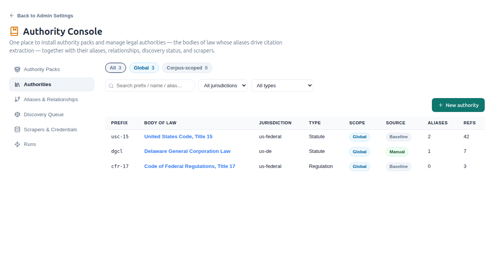
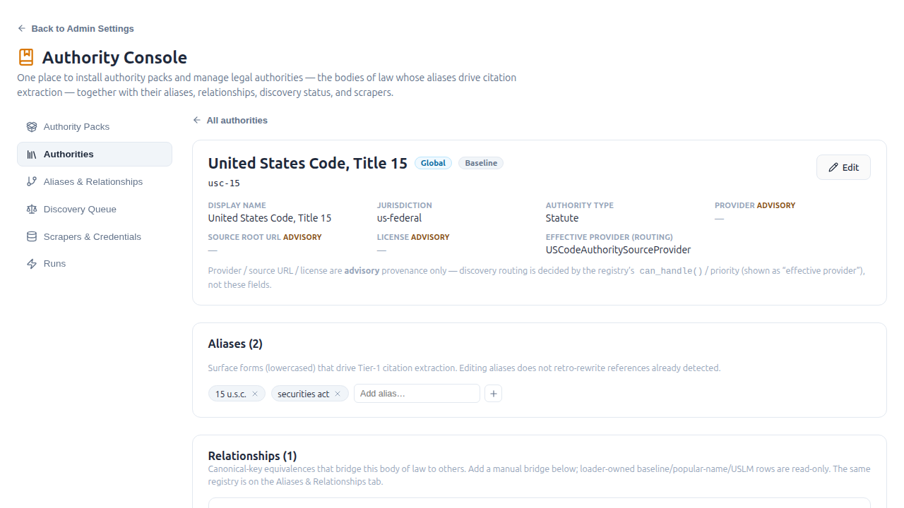
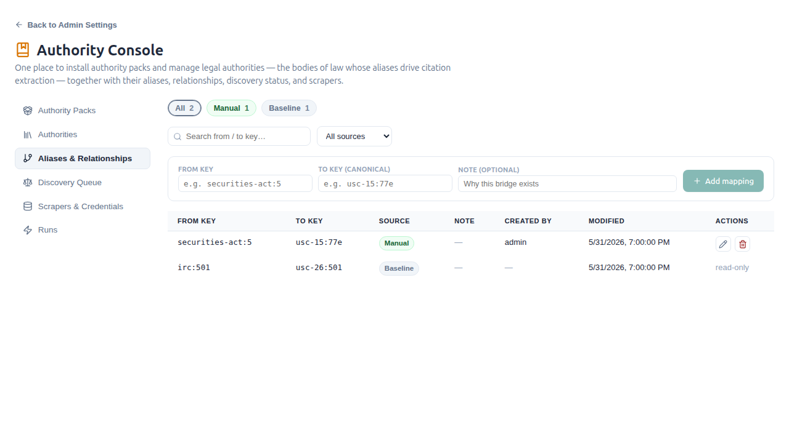
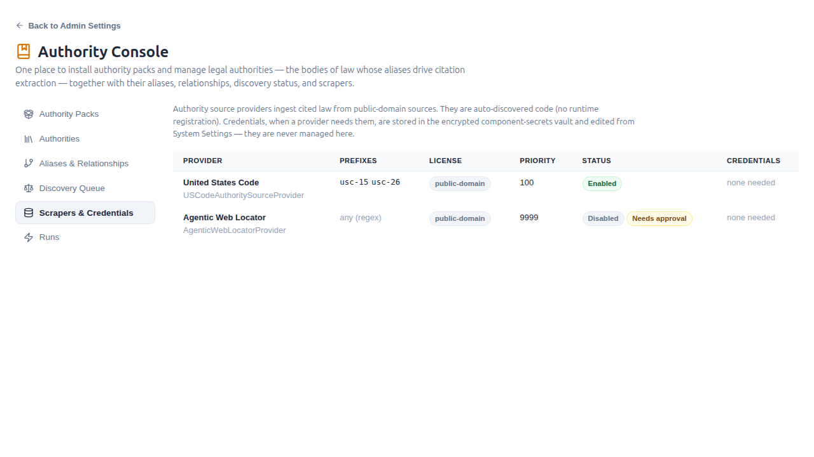

# Authority Console

The **Authority Console** is the single admin surface for viewing, managing, and
editing *authorities* — the bodies of law (USC titles, CFR parts, statutes,
regulations, administrative regimes) whose aliases drive citation extraction and
whose corpora can be installed and sideloaded as reusable packs. It lives at
**`/admin/authority`** and is superuser-gated.

It is the management layer for the open-vocabulary authority-discovery engine
described in
[Reference-Web Enrichment & Authority Discovery](reference-web-enrichment.md); for
runnable ingestion procedures see
[Ingesting Authorities & Adding Providers](../guides/ingesting-authorities.md).

## Overview

The discovery *pipeline* (taxonomy, shape grammars, the source-provider registry,
the crawl frontier) shipped well-factored, but its *management* was scattered
across several mechanisms with no unifying concept of "an authority":

| Concern | Before | Now |
|---|---|---|
| Authority packs | management-command-only installation | Authority Packs catalog, preflight, install, and targeted corpus sideload |
| `AuthorityNamespace` (the body-of-law registry) | **no API/admin/GUI** — hand-edit `authority_mappings.yaml` + re-run the loader | Registry tab + `AuthorityNamespaceService` |
| `AuthorityKeyEquivalence` (aliases/relationships) | standalone `AuthorityMappings` panel | Aliases & Relationships tab |
| `AuthorityFrontier` (discovery queue) | read-only `AuthoritySourcesMonitor` panel | Discovery Queue tab (now with action verbs) |
| Source providers ("scrapers") | code-only, invisible to the API | Scrapers & Credentials tab |
| Enrichment runs | standalone `AdminEnrichment` page | Runs tab |

The console consolidates these concerns behind one tabbed front door. The three
standalone panels (`AuthorityMappings`, `AuthoritySourcesMonitor`,
`AdminEnrichment`) were **deleted**; `GlobalSettingsPanel`'s three separate admin
cards collapsed into one **Authority Console** card.

The organizing principle is **`AuthorityNamespace`-as-spine**: every link between
the authority models is a *string join* on the canonical-key prefix (there are no
foreign keys between them), so a registry keyed on the namespace prefix is
literally the join root. Genuinely instance-wide concerns (the whole frontier
queue, the provider registry, run history) get honest sibling tabs at their
natural altitude rather than being crammed into per-authority drawers.

## The console & its tabs

`AuthorityConsole` (`frontend/src/components/admin/authority/AuthorityConsole.tsx`)
is mounted at one wildcard route, `/admin/authority/*`, and parses
`/admin/authority/<tab>[/<prefix>]` itself. State lives in the URL (deep-linkable;
the URL is the source of truth). It gates once at mount via `useIsAuthorityAdmin`.

| Route | View | Absorbed from |
|---|---|---|
| `/admin/authority/packs` | **Authority Packs** | new surface |
| `/admin/authority` → `/admin/authority/registry` | **Authorities** (Registry) | new surface |
| `/admin/authority/registry/<prefix>` | **Authority detail** | new surface |
| `/admin/authority/mappings` | **Aliases & Relationships** | `AuthorityMappings` (was `/admin/authority-mappings`) |
| `/admin/authority/queue` | **Discovery Queue** | `AuthoritySourcesMonitor` (was `/admin/authorities`) |
| `/admin/authority/scrapers` | **Scrapers & Credentials** | new surface |
| `/admin/authority/runs` | **Runs** | `AdminEnrichment` (was `/admin/enrichment`) |

The three old paths (`/admin/authorities`, `/admin/authority-mappings`,
`/admin/enrichment`) remain as client-side `<Navigate>` redirects into the
corresponding tab so existing bookmarks keep working for one release.

### Authority Packs tab

The trusted server catalog is discovered from the shipped pack directory and
`AUTHORITY_PACK_ROOTS` / `AUTHORITY_PACK_PATHS`. The browser sends an opaque
pack ID, never a filesystem
path, URL, archive, or manifest. Opening a pack runs a fresh side-effect-free
preflight and displays its fingerprint, corpus identities, current installation
state, source-host lineage, and publication approval.

Installation is private by default and atomically reuses the same
`AuthorityPackService` as the legacy operator command. Public installation is
an explicit option and remains disabled while a declared charter is unapproved
or `pending_legal_review`.

Once a corpus is installed, **Import corpus ZIP** opens the existing
corpus-export modal with that corpus's server-issued ID. Direct and resumable
chunked uploads therefore share the normal import service and permission gate;
the console does not add a second ingestion system. This supports deployments
whose acquisition/crawling happens outside OpenContracts.

### Authorities (Registry tab)

The master list of `AuthorityNamespace` rows. Faceted scope chips (global / corpus)
plus jurisdiction and authority-type selects and free-text search drive the
`authorityNamespaces` relay connection; an inline **New authority** form creates a
row; the table (Prefix / Body of law / Jurisdiction / Type / Scope / Source /
Aliases / Refs) links each display name into the detail view. Chip counts come from
`authorityNamespaceStats`, which honours the same `search` predicate as the list so
counts can never desync from rows.

### Authority detail

One body of law, assembled by `AuthorityNamespaceService.detail()` (one
`authorityNamespaceDetail(prefix)` query) via string joins. Sections:

| Section | Editable? | Notes |
|---|---|---|
| **Header / metadata** | ✅ display name, jurisdiction, authority type | via `updateAuthorityNamespace` |
| **Provider / source URL / license** | ✅ but **advisory only** | routing is decided by the registry's `can_handle()`/priority; the resolved **effective provider** is shown alongside |
| **Aliases** | ✅ | add/remove lowercased chips that drive Tier-1 extraction; editing does **not** retro-rewrite already-detected references |
| **Relationships** (key-equivalences) | ✅ manual rows only | shared editor with the Mappings tab; loader-owned baseline/popular-name/USLM rows are read-only |
| **Discovery queue** | read-only | state-count badges + frontier rows; the row action verbs live in the Queue tab |
| **References** | read-only by design | machine-populated; total + per-status counts only |
| **Danger zone** | delete | allowed only when no equivalence / frontier / reference row still references the prefix |

### Aliases & Relationships (Mappings tab)

The `AuthorityKeyEquivalence` registry (e.g. act-section ↔ USC/CFR canonical-key
bridges). Source chips + source filter + search over `authorityKeyEquivalences`,
an inline create form, and per-row edit/delete via the shared `KeyEquivalenceEditor`
(reused by the detail view's Relationships section). Manual rows are editable;
loader-owned rows are read-only.

### Discovery Queue tab

The instance-wide `AuthorityFrontier` crawl/ingestion backlog. State chips +
provider/jurisdiction/type facets + search over `authorityFrontier`,
checkbox multi-select with a sticky action bar (Run discovery / delete), and — new
in the console — per-row **requeue / reset / reroute / approve / delete** verbs.
Reroute is constrained client-side to the registered provider class names from
`authoritySourceProviders`.

### Scrapers & Credentials tab

A read-only view of the registered source providers (US Code / eCFR / Federal
Register / agentic web locator) from `authoritySourceProviders`: supported
prefixes, license, priority, the enabled and requires-approval flags, and whether
the secrets vault holds credentials. Enabling/disabling stays in code; credentials
are edited through System Settings' component-secrets vault
(`updateComponentSecrets`), **not** here — the console never invents a parallel
credential store. Providers can be shipped *inside* an authority pack
(`<pack>/providers/`) so a scraper travels with its jurisdiction — see
[Authoring an Authority Pack](../guides/authoring-authority-packs.md).

### Runs tab

Dispatch reference-enrichment / authority-discovery analyses on a corpus and review
job status. The corpus picker, `EnrichmentRunner`, and `EnrichmentJobList` are
re-mounted **unchanged** from `components/admin/enrichment/` (they also back the
per-corpus `CorpusEnrichmentCard`, which is why they stay in that directory rather
than moving under `authority/`).

## `AuthorityNamespace` — the spine

`AuthorityNamespace` (`opencontractserver/annotations/models.py`) is the registry
of bodies of law whose `aliases` drive Tier-1 citation extraction. Two fields added
for the console give it runtime ownership semantics:

- **`source`** (`baseline` | `manual`) — an ownership marker mirroring
  `AuthorityKeyEquivalence.source`. The loader
  (`AuthorityMappingLoader.load_namespaces`) owns only `baseline` rows: it upserts
  YAML prefixes as `baseline` and **skips any `manual` row** (alongside its existing
  skip of corpus-linked rows). Every row created or edited through the console is
  stamped `manual`, so a YAML re-load can no longer silently clobber a curator's
  runtime edits — a real bug the previous loader had (it `update_or_create`d every
  global prefix).
- **`created_by`** — provenance for who curated the row (`SET_NULL`; null for
  loader-owned baseline rows).

Because there are **no foreign keys** between the authority models, the
single-authority projection joins by string key. The join is **colon-anchored** on
`"<prefix>:"` (e.g. `usc-1:`), never the bare prefix — so `usc-1` never swallows
`usc-15`.

## Services & the `is_authority_admin` gate

All access routes through `opencontractserver/enrichment/services/` (per the
service-layer invariant; the GraphQL surface is E001-clean).

**`AuthorityNamespaceService`** — the runtime CRUD + read peer to
`AuthorityKeyEquivalenceService` (extends `BaseService`):

| Method | Behaviour |
|---|---|
| `visible(user)` | all rows for an admin, else `.none()` — the queryset-gate peer to the node's `get_queryset`, which inlines the same `is_authority_admin` check |
| `stats(user, search)` | faceted counts (`by_jurisdiction` / `by_authority_type` / `by_scope`); honours `search` but not the facet selects |
| `detail(user, prefix)` | the string-join projection (aliases + in/out equivalences + frontier rows + reference counts + effective provider); `None` for non-admins or unknown prefix (opaque) |
| `create(...)` | validates the prefix grammar, normalizes aliases, stamps `source="manual"` + `created_by`; surfaces the `is_global`⊕`authority_corpus` `ValidationError` as a clean error |
| `update(pk, **partial)` | partial edit; always re-stamps `source="manual"` so the curator override wins over the shipped baseline |
| `set_aliases(pk, aliases)` | the one alias writer (lowercase + de-dupe + sort) — delegates to `update` |
| `delete(pk)` | refuses with a count-bearing error if any equivalence / frontier / reference row still references the prefix, so a delete never orphans dependents |

**`AuthoritySourceProviderService.list_providers(user)`** — read-only projection of
the auto-discovered provider classes, with `has_credentials` derived from the
existing `PipelineSettings` encrypted-secrets vault (degrades to "no credentials" if
the vault read fails rather than breaking the listing).

**`AuthorityFrontierService`** — the discovery-queue action verbs, each a thin
wrapper over the single transition primitive `mark()`:

| Verb | Effect |
|---|---|
| `requeue(pk)` | `→ queued`, clears `ingested_document` + `last_error` (un-sticks `deferred_cap`/`failed`) |
| `reset(pk)` | `→ queued`, clears document + provider + error |
| `reroute(pk, provider)` | validates `provider` against the registry, sets it, `→ queued`, clears document + error |
| `approve(pk)` | `pending_approval → queued` (clears error only) |
| `delete_rows(pks)` | guarded bulk delete |

`mark()` gained explicit `clear_document` / `clear_error` / `clear_provider` /
`set_provider` kwargs so it stays the *single writer* of frontier state. Clearing
`ingested_document` on requeue is mandatory: the `frontier_queued_no_ingested_doc`
check constraint forbids a `queued` row that still carries a document. The
re-queueing verbs refuse a row that is `in_progress` (a worker is actively
ingesting it).

**The gate.** `is_authority_admin(user)`
(`opencontractserver/enrichment/services/authority_permissions.py`) is the **one**
authority-admin gate — `bool(user and user.is_authenticated and user.is_superuser)`
today, with the single future seam (a `law_librarian` group/flag) living here and
nowhere else. Authority data is system-wide with no per-object permissions, so it
cannot use the corpus/document guardian model. The companion `DENIED` constant
(`"Resource not found or you do not have permission."`) is returned identically
whether a row is missing or the caller lacks access, so the superuser-only surface
is **no existence oracle**. The gate is threaded through every authority service
method, every authority node's `get_queryset`, and every authority mutation —
consolidating the per-surface inline `user.is_superuser` checks that existed before.

### GraphQL surface

All in `config/graphql/` (queries in `annotation_queries.py`, types in
`annotation_types.py`, filter in `filters.py`):

- **Queries** (superuser-only): `authorityNamespaces` (filtered relay connection),
  `authorityNamespaceStats`, `authorityNamespaceDetail(prefix)`,
  `authoritySourceProviders`.
- **Mutations** (`@login_required` + superuser via the service):
  `create` / `update` / `setAliases` / `delete` `AuthorityNamespace`
  (`authority_namespace_mutations.py`); `requeue` / `reset` / `reroute` /
  `approve` / `delete` `AuthorityFrontier` (`authority_frontier_mutations.py`).
- The choice-bearing fields `source` and `authority_type` are declared as raw
  `graphene.String` (not auto-enums) and the filter uses String `CharFilter`s, so
  the faceted chip values feed straight back into the list filter.

### Migrations

- **0099** — adds `AuthorityNamespace.source` (`baseline`/`manual`, indexed,
  default `baseline`) and `created_by`.
- **0100** — retires the dead `AuthorityFrontier.discovery_state` values
  `discovered` and `resolved` (choices-only `AlterField`, no data migration). No
  production path ever assigned them — discovery goes `in_progress → ingested`, and
  the resolution outcome lives on the relink result / `Analysis`, not the frontier
  row.

## Permissions

The whole console is **superuser-only**, enforced server-side at the node
`get_queryset` and service layer (not merely hidden in the UI). `useIsAuthorityAdmin`
gates the frontend the same way, using the wait-on-`null` pattern so an admin never
sees an "Access Denied" flash mid-load. Note this differs from the enrichment
*runs* themselves: `runCorpusEnrichment` is gated on corpus **UPDATE** (with the
superuser READ-trigger exemption) — see
[Reference-Web Enrichment § Permissions](reference-web-enrichment.md#permissions).

## Design notes

The chosen architecture (an `AuthorityNamespace`-pivot home + cross-cutting sibling
tabs) won out over a "graph-is-the-console" alternative: the instance-wide editable
graph was judged risk-inverting eye-candy, and the namespace pivot matches the data
model — every cross-model link is a string join on the prefix, so the registry *is*
the join root. The interactive graph is demoted to an optional, deferrable detail
**lens** (not built here); the corpus-scoped `GovernanceGraphExplorer` remains the
place to explore the citation graph.

Five decisions were settled during design and carried into the implementation:

1. **References stay strictly read-only.** They are machine-populated and would be
   clobbered by the next relink; no `SetCorpusReferenceCanonicalKey` mutation
   exists. (Revisit only behind a persisted `is_manual_override` flag if demanded.)
2. **`mark()` is extended, not bypassed.** The action verbs clear fields via new
   `clear_*` kwargs on `mark()` rather than writing frontier fields outside it, so
   it remains the literal single writer of discovery state.
3. **Dead states are retired, not wired.** `discovered`/`resolved` were removed from
   the choices (migration 0100) rather than plumbed through the async relink seam,
   which would have added race surface for no behavioural gain.
4. **Advisory provider columns stay editable but clearly advisory.** Admins can
   record `provider`/`source_root_url`/`license` as provenance metadata, but routing
   stays registry-driven; the resolved **effective provider** is shown beside them.
5. **Old routes redirect for one release.** The three deleted paths render
   client-side `<Navigate replace>` redirects into the new tabs (SPA redirects, not
   HTTP 301s), then can be removed.

## Known limitations & follow-ups

- **Detail-view frontier actions.** The authority detail's Discovery-queue section
  is read-only; the per-row verbs are available in the Queue tab. Wiring them into
  the detail is an optional nicety.
- **Graph lens (deferred).** An authority-only `?lens=graph` projection on the
  detail view, reusing `utils/governanceGraphLayout.ts`, was designed but not built.
- **Filtered-state screenshot.** A console-tab screenshot of the queue filtered to a
  single state is not yet captured; regenerate via the screenshot workflow when
  needed.
