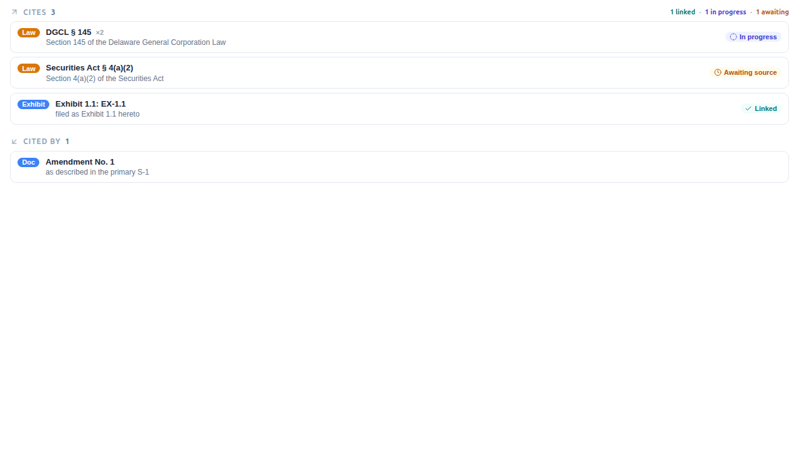
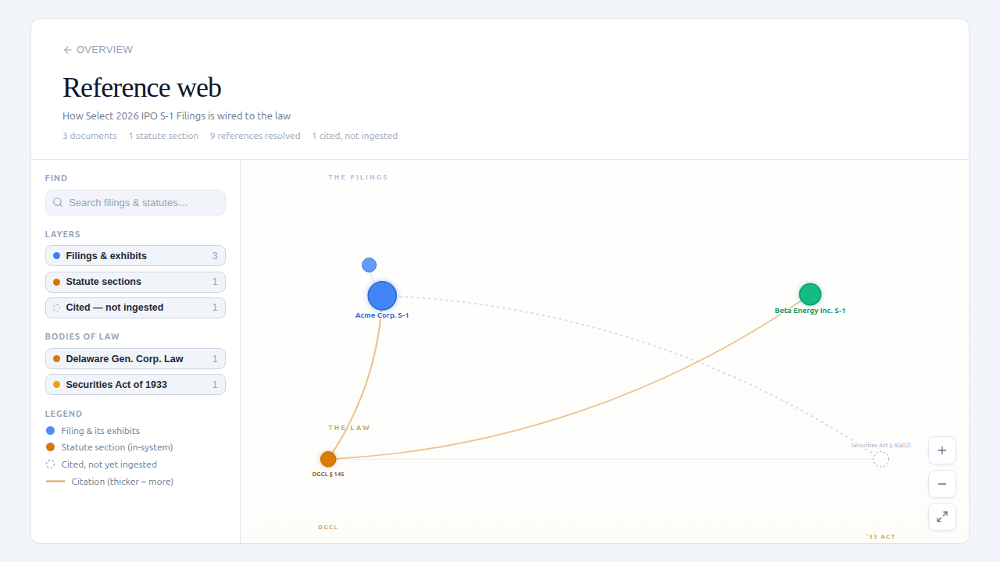
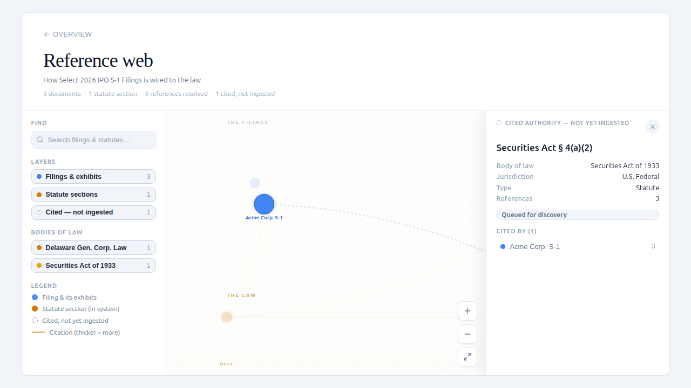

# Reference-Web Enrichment & Authority Discovery

## Overview

**Enrichment** turns a corpus of documents into a *reference web*: it detects every
explicit legal citation, cross-reference, and exhibit link in the text, resolves
each to a target (another document, an internal section, or an external body of
law), and persists the result as `CorpusReference` rows plus the
`DocumentRelationship` edges the governance graph renders.

**Authority discovery** is the recursive follow-on: the citations a corpus makes
to laws it does *not* contain (the "wanted authorities") seed a global
`AuthorityFrontier` queue, and a bounded crawl ingests those statutes/regulations
from public-domain providers so the citations resolve from `EXTERNAL` to
`RESOLVED`.

This document covers the detection engine, the in-flight persistence lifecycle,
the cross-document concurrency model, the authority crawl, and how to operate all
of it (trigger, monitor, explore). It assumes the reader is comfortable with the
Django/Celery backend.

> **Related**
> - Design specs: `docs/superpowers/specs/2026-06-16-corpus-enrichment-runner-design.md`,
>   `docs/superpowers/specs/2026-06-17-in-flight-authority-detection-design.md`,
>   `docs/superpowers/specs/2026-06-17-global-authority-sources-view-design.md`
> - Manual procedure: `docs/test_scripts/corpus_reference_enrichment.md`
> - Versioning gap: `docs/architecture/reference-web-versioning.md`

---

## The detection tiers

Detection is **additive**: the trusted registry tier is always the base, and
`extra_tiers` selects which *additional* layers merge on top of it. The tiers are
stamped on each `CorpusReference.detection_tier`:

| Tier | Component | What it finds | Cost |
|------|-----------|---------------|------|
| `registry` | `ReferenceExtractor` + `authority_alias_registry` | Known authorities by curated alias (DGCL, USC, CFR, the Securities/Exchange Acts, …) | Instant |
| `grammar` | `GenericCitationExtractor` | Open-vocabulary "… Act / § …" citation *shapes* the registry doesn't know | Instant |
| `llm` (Tier-2b) | `LLMCitationExtractor` | The long tail a grammar can't express — pinpoint statute sections, international law, accounting standards, etc. | Slow, **opt-in** (`use_llm=True`), external provider calls |

On a real S-1 corpus the LLM tier surfaces authorities no grammar reaches — ERISA
sections, EU Prospectus Regulation sub-articles, UK FSMA, DOL prohibited-transaction
exemptions, accounting standards (ASC/ASU), tax (IRC/Treasury Reg) — alongside the
registry/grammar hits.

`reconcile()` merges the tiers with a clear precedence: **the registry wins on
span overlap**, and grammar/LLM candidates add only the non-overlapping tail. So a
citation the grammar already catches is never *also* stored as a (lower-trust) LLM
row.

### Customs / trade grammar family (CBP CROSS-style corpora)

The grammar tier also ships two deterministic customs families
(`opencontractserver/enrichment/grammars.py::_hts` /
`::_document_identifier_citations`; shapes ported from crossfeed's
golden-tested CROSS extractor). Because they are ordinary grammar-tier
candidates, they run automatically wherever enrichment already runs — the
analyzer task, the ADD_DOCUMENT corpus action installed by
`setupCorpusIntelligence` / `ingest_corpus --enrich`, the
`runCorpusEnrichment` mutation, and the agent tools. There is no separate
service or management command.

- **HTS tariff codes** → `REF_LAW` citations keyed `htsus:<code>`
  (`constants.HTSUS_PREFIX`; prefix declared in `authority_mappings.yaml`).
  Gated on a document-level HTSUS cue so dotted decimals in ordinary corpora
  are never mined; per-mention confidence distinguishes tariff-cue-anchored
  codes from bare contextual ones.
- **Title-identifier document citations** (CBP ruling numbers) →
  `REF_DOCUMENT` citations resolved by `ReferenceResolver` against sibling
  document titles (canonicalized via
  `constants.document_identifier_from_title` — extension-stripped, so
  materialized-filename titles like `A83482.doc` still resolve). The grammar
  only activates on corpora whose titles are predominantly identifier-shaped
  (`constants.DOC_IDENTIFIER_TITLE_GATE_*`); self-mentions (a ruling's own
  header) are dropped at resolution. Citations to rulings not yet in the
  corpus persist `UNRESOLVED` and are healed to `RESOLVED` by the writer when
  the sibling lands and enrichment re-applies — which the ADD_DOCUMENT corpus
  action does automatically.

---

## The enrichment pipeline

`EnrichmentService` (`opencontractserver/enrichment/services/enrichment_service.py`)
is the single entry point:

- **`scan`** — extract + resolve across the corpus, return an inventory, **no writes**.
- **`discover`** — read-only open-vocabulary inventory grouped by jurisdiction /
  authority type, flagging prefixes with no `AuthorityNamespace` row (genuinely new
  bodies of law).
- **`apply`** — scan, then persist under an `Analysis` (the durable run).

For each document `apply` runs: **detect** (registry + grammar + optional LLM) →
**resolve** (`ReferenceResolver` maps each candidate to a target + a
`resolution_status`) → **write** (`EnrichmentWriter` materialises annotations,
within-document `Relationship`s, and `CorpusReference` rows; resolved doc→doc
references roll up once into the `DocumentRelationship` projection the graph
renders).

The Celery surface is the `@corpus_analyzer_task`-decorated
`corpus_reference_enrichment` task, which owns the `Analysis` lifecycle
(`RUNNING → COMPLETED/FAILED`). Crucially, the decorator does **not** wrap the task
body in a transaction — which is what makes the per-document writes below commit
independently and become visible mid-run.

---

## In-flight persistence & the provisional lifecycle

Historically `apply` did one bulk write at the very *end* of a run. For the slow
LLM tier that meant nothing was queryable for the whole pass, and a worker restart
at minute *N* lost all *N* minutes of work (observed: a 72-minute run orphaned at
`RUNNING` with zero rows written).

Enrichment now persists **incrementally**. Each `CorpusReference` carries
`is_provisional` (`BooleanField`, default `False` — migration
`annotations/0090_corpusreference_is_provisional`, schema-only so every pre-existing
row is already finalized):

1. **Stream.** `apply` writes each document's references the moment that
   document's detection completes, marked `is_provisional=True`, in its own
   committed transaction — so the References panel, governance graph, and
   `/admin/authority/queue` fill *during* the run.
2. **Finalize.** On success the run flips its own rows finalized in one atomic
   update keyed on `created_by_analysis`:
   `CorpusReference.objects.filter(created_by_analysis=run, is_provisional=True).update(is_provisional=False)`.
3. **Resilience (claim rule).** A run that dies mid-flight leaves its rows
   provisional. The writer's claim rule (`EnrichmentWriter._ensure_corpus_reference`)
   re-attributes any still-provisional row it re-touches to the current run —
   regardless of whether the prior owner FAILED or is stuck RUNNING — so the next
   successful run **reclaims and finalizes** orphaned rows with no reaper required.
   A *finalized* row is never downgraded, even mid-re-run.

> **Show provisional, act on finalized.** Display surfaces (References panel,
> governance graph, the authorities monitor) render in-flight rows so progress is
> visible. Irreversible work acts on finalized rows only: the crawl seed pulls
> `CorpusReferenceService.wanted_authorities(finalized_only=True)`, so a
> half-finished run can never trigger an authority ingest. `isProvisional` is
> exposed on `CorpusReferenceType` for the frontend.

The document References panel badges in-flight references **In progress** (taking
precedence over their preliminary Linked / Awaiting state) until the run finalizes:

---

## Cross-document LLM concurrency

The LLM tier was originally strictly serial — every ~2,000-char window of every
document was a sequential `await` (one corpus measured ~2,900 serial calls). Two
changes make it concurrent while preserving the incremental writes above:

- **Within a document**, `LLMCitationExtractor.aextract`
  (`opencontractserver/enrichment/llm_citation_extractor.py`) enumerates its
  sliding-window chunks and runs them through `asyncio.gather` behind a semaphore.
  The window grew from 2,000 → 8,000 chars (≈4× fewer chunks, ~5% overlap instead
  of 20%). Chunk results are processed in input order so the "first chunk wins"
  dedup stays deterministic.
- **Across documents**, `EnrichmentService._aresolve_documents` extracts *all*
  documents concurrently under **one shared global chunk-semaphore**
  (`LLM_MAX_CONCURRENCY`, default 8) — so total in-flight provider load stays
  bounded no matter how many documents are in flight, while the lanes stay full
  (the per-document path under-utilised them whenever a corpus had a few large
  documents). Each document is still written the instant its detection completes.

DB writes are marshaled through `sync_to_async` (thread-sensitive → one shared
thread), so the ORM writes serialise and never race; only the LLM calls run
concurrently. `apply` selects this path automatically when the LLM tier is active
and keeps the simple synchronous streaming loop for the fast tiers.

**Measured** on a 75-document / 4.5 MB S-1 corpus: ~72 min (and the run died) →
**~4 min**, completing with all references finalized.

> **Tuning.** The global cap defaults to a conservative `LLM_MAX_CONCURRENCY` (8);
> raise it via the `ENRICHMENT_LLM_MAX_CONCURRENCY` env var / Django setting (no
> code change) to push toward ~2–3 min, at the cost of higher provider rate-limit
> / cost exposure.

---

## Authority discovery & the crawl frontier

EXTERNAL law references are the corpus's *wanted authorities* — laws it cites but
does not contain. `AuthorityFrontierService.seed_from_wanted_authorities` rolls
them up to section roots and upserts one `AuthorityFrontier` row per root (the
instance-wide, system-managed discovery queue). `crawl_authorities` then drives a
bounded BFS: dequeue by demand, pick a public-domain provider, fetch + gate-verify,
bootstrap an authority corpus, relink the citations, and seed the ingested
authority's own outbound citations at `depth+1`.

Each frontier row carries a `discovery_state`:

`queued` · `in_progress` · `ingested` · `failed` ·
`unsupported` · `blocked_license` · `unlocated` · `pending_approval` · `deferred_cap`

Two pieces worth calling out:

- **Provider selection + the namespace bridge.** `AuthorityDiscoveryService._provider_for`
  picks a provider by `can_handle`. Providers only handle positive-law keys
  (`usc-*`, `cfr-*`, `fedreg`), but filings cite *popular-name* domain keys
  (`exchange-act:10`). Rather than mark those `unsupported`, `_provider_for`
  resolves a provider-supported `AuthorityKeyEquivalence` counterpart
  (`exchange-act:10 → usc-15:78j`) and fetches under that; the post-ingest relink
  then upgrades the original popular-name references.
- **The gate.** `AuthorityGateService` enforces verification + license + source
  domain before anything is ingested (agentic providers can require approval).

---

## Operating it

> **Step-by-step how-to:** for runnable procedures — ingesting a supported
> source (shell, crawl, or the Runs tab) and adding a new provider to flip an
> authority from `unsupported` to supported — see
> [Ingesting Authorities & Adding Providers](../guides/ingesting-authorities.md).
> The admin surfaces named below are tabs of the
> [Authority Console](authority-console.md) at `/admin/authority`.

### Trigger — the Runs tab

`/admin/authority/runs` (the Runs tab of the Authority Console, and a per-corpus
card) drives runs via the
`runCorpusEnrichment` mutation. Pick reference enrichment and/or authority crawl,
optionally enable the LLM detection tier and the advanced crawl bounds (max depth,
min demand, max authorities, per-jurisdiction cap, token budget), and Run. The
mutation is gated on corpus **UPDATE** (see Permissions below).

### Monitor — live job status & the Queue tab

The Runs tab's job list shows each `Analysis` live (`RUNNING` / `COMPLETED` /
`FAILED`, elapsed, result summary) via an `Analysis → Notification` signal over the
notification WebSocket.

For the instance-wide picture, the **Queue tab** of the Authority Console
at `/admin/authority/queue` (superuser-only) is the ingestion backlog over the whole
`AuthorityFrontier`: per-state count chips, jurisdiction / type / provider filters,
search, and a backlog-first table. It is powered by the `authorityFrontier` relay
connection + `authorityFrontierStats` (both superuser-gated) and
`AuthorityFrontierService.admin_state_counts`. Beyond observing, it exposes per-row
**requeue / reset / reroute / approve / delete** verbs; triggering enrichment runs
stays on the Runs tab.

### Explore — the governance graph

Every corpus landing page shows a static governance-graph *glimpse*; "Explore the
full graph" opens the deep-linkable interactive **explorer** at `?view=graph`
(`GovernanceGraphExplorer`, sharing `utils/governanceGraphLayout.ts` with the
glimpse). Filings sit above, the law shelf below; pan/zoom, search, and
kind/authority filters (dim, don't reflow) let you navigate, and selecting a node
opens a detail drawer.

The drawer is where in-flight authority discovery becomes legible: a cited-but-not-
yet-ingested ghost node surfaces its body of law, jurisdiction, authority type, and
frontier crawl state — the fields the static glimpse can't show.

---

## Permissions

Reference enrichment and the authority crawl are **write** operations, so the
`runCorpusEnrichment` mutation requires corpus `UPDATE`. Superusers are a scoped
exception: they may trigger enrichment/crawl on any corpus they can **READ**
without holding `UPDATE` — a retained admin privilege documented in
`docs/permissioning/consolidated_permissioning_guide.md`. The exemption widens the
*write-trigger* only; a superuser still cannot see a corpus they lack READ on (no
blanket bypass). The `/admin/authority/queue` Queue tab and the `authorityFrontier`
queries are superuser-gated at the node level.

---

## Known limitations & follow-ups

- **Open-vocabulary noise.** The LLM tier trades some precision for recall. A
  normalization pass in `_derive_canonical_key` / `aextract` folds separator
  variants (`eu:2017/1129` → `eu:2017-1129`) and flags locator-less `act:*`
  references — bodies of law / loose phrases with no section number
  (`act:gaap`, `act:applicable-law`, `act:guam-administrative-adjudication-law`)
  — as `needs_review`, so they surface for triage but never auto-promote into the
  persisted reference web or crawl frontier. A future pass could fold known-body
  references into curated `AuthorityKeyEquivalence` rows.
- **Re-run churn.** Re-running the LLM tier produces ~10–15% new mention rows from
  span nondeterminism even at temperature 0 (idempotent on `canonical_key`, but
  distinct spans yield distinct mention annotations).
- **Versioning.** Amendments do not yet re-point already-`RESOLVED` references to
  the new section version — see `docs/architecture/reference-web-versioning.md`.
- **Live per-document progress counter (deferred).** Progress during a run is
  conveyed today by the RUNNING job status, the incrementally-appearing refs, and
  the "In progress" badge. A live per-document counter on the Authority Console
  Runs tab (e.g. "12 / 75 documents · 31 references") would need a transient
  `ENRICHMENT_PROGRESS` WebSocket message emitted from both `apply` paths and a
  new handler in `useNotificationWebSocket` → `useEnrichmentJobs` →
  `EnrichmentJobList`. Deferred as its own change (the WS path is not
  component-test-exercisable, so it needs a live verification pass).
