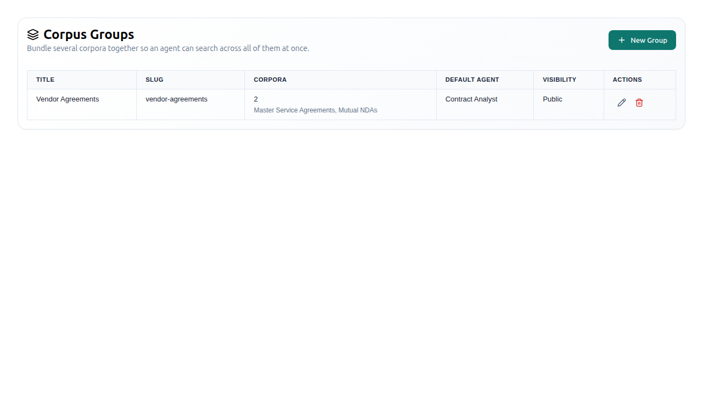
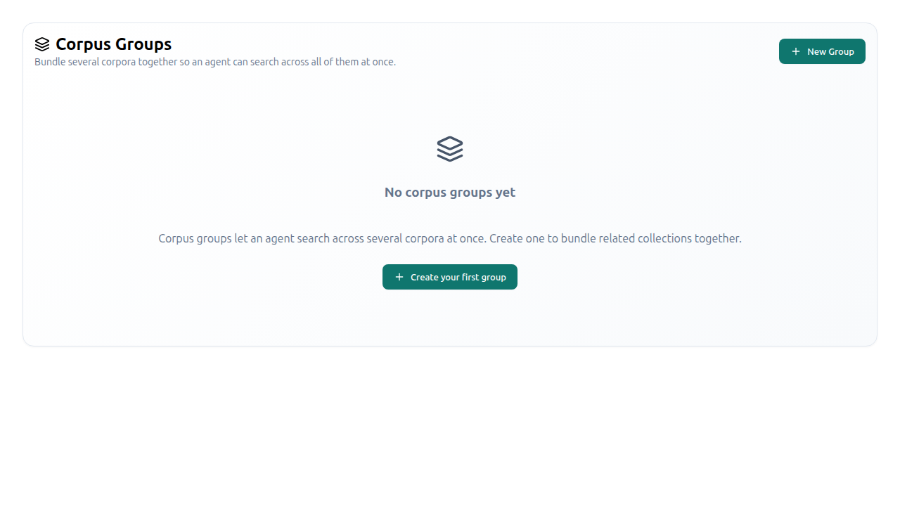

# Corpus Groups

A **corpus group** is a named bundle of corpora that an agent can retrieve
across in a single step. It exists so a question that spans several collections
— "what do our vendor agreements and our policy library say about
subprocessors?" — does not require the user to pick one corpus and hope.

The retrieval side is the `search_across_corpora` agent tool
(`opencontractserver/llms/tools/core_tools/multi_corpus.py::asearch_across_corpora`).
It takes the group's **slug or numeric ID**, fans the query out over every
member corpus, and returns hits grouped per corpus. Membership is resolved at
call time from the group's `corpora` M2M — never from a config-time snapshot —
so adding or removing a corpus takes effect on the very next question.

A group may also bind a **default agent**
(`agents.AgentConfiguration`). That is the orchestrator persona for the group;
its `available_tools` should include `search_across_corpora`.

## Managing your groups

Sign in, open the avatar dropdown in the top bar, and choose **Corpus Groups**
(route `/corpus-groups`). The panel is
`frontend/src/components/corpus_groups/CorpusGroupManagement.tsx`.

The list shows **only the groups you created**. There is no instance-wide
listing and no superuser view — superusers see their own groups and nothing
more, same as everyone else.

The create/edit form manages:

| Field | Notes |
|---|---|
| **Title** | Required. |
| **Slug** | Optional — auto-generated from the title when left blank. This is the handle an agent uses to name the group, so a readable slug is worth setting. An explicit slug that collides is rejected rather than de-duplicated. |
| **Description** | Free text. |
| **Corpora** | Multi-select over the corpora you can READ. Editing a group **replaces** its membership with what the form submits, so the form always carries the full desired set. |
| **Default agent** | Optional single-select over active agent configurations; clearing it unbinds the agent. |
| **Public** | Makes the group itself visible to anyone. It does **not** publish the member corpora. |

Deleting a group removes only the group; the member corpora are untouched.

## Who can see what

Group visibility is the ordinary object-permission surface (creator,
`is_public`, or an explicit guardian grant). Membership, however, is **not** a
permission grant: a member corpus you cannot READ is never searched for you and
never disclosed to you. The intersection is recomputed on every call by
`opencontractserver/corpuses/services/corpus_groups.py::CorpusGroupService.get_group_corpora_visible_to_user`,
so putting a corpus into a public group can never widen access to it. The bound
`default_agent` is gated the same way.

See the
[Consolidated Permissioning Guide](../permissioning/consolidated_permissioning_guide.md)
("CorpusGroup (multi-corpus retrieval bundles)") for the full rule set and the
anonymous-access behaviour.

## Django admin

There is no `CorpusGroup` admin page. The registration was removed from
`opencontractserver/corpuses/admin.py` in favour of this GUI (#2141) so there is
exactly one management surface — the admin form was superuser-only and wrote
straight to the model rather than through `CorpusGroupService`.
