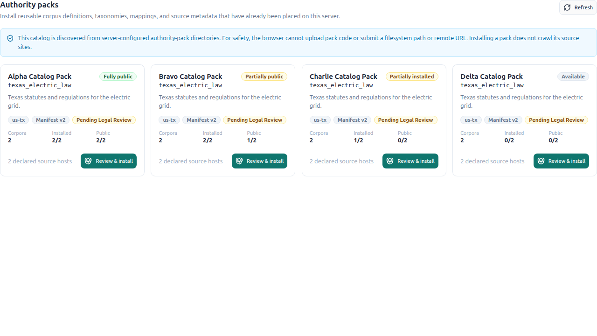
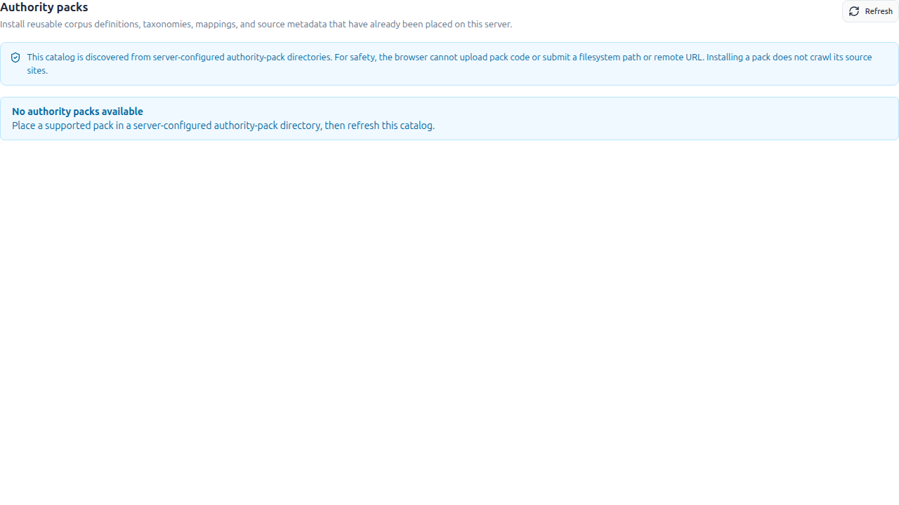
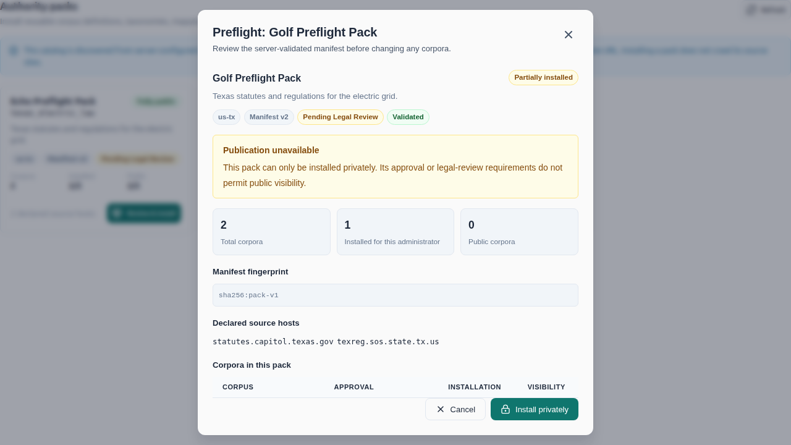

# Authoring an Authority Pack

An **authority pack** is a single, self-contained directory that stands up a body
of law for a jurisdiction — its citation taxonomy, optional scraper, target
corpora, and agent personas — as **data + one small module**, with **no bespoke
Django app**. Because everything for one authority lives in one place, a pack is
**copy-to-add, delete-to-remove, copy-to-port**: drop the directory into another
OpenContracts install and the authority comes with it.

This is the operator/author how-to. For the management UI see
[Authority Console](../architecture/authority-console.md); for the
detection→discovery→crawl engine see
[Reference-Web Enrichment](../architecture/reference-web-enrichment.md); for the
original design rationale and the gap/phasing analysis see the proposal,
[0002 — Authority Packs](../architecture/proposals/0002-authority-packs.md).

**Packs are deployment data, not product code.** The tree ships one worked
example (`bolivia`) so the format has a reference implementation and the
machinery has something to exercise. A real body of regulation — the corpora an
install actually curates, with its own legal-review state, refresh cadence, and
publisher relationships — belongs in its own repository and is **sideloaded**
(see [Installing a sideloaded pack](#installing-a-sideloaded-pack)). Nothing
about a pack needs to be in this tree to work: taxonomy, scraper, SSRF
allowlist entries, and corpus definitions all travel inside the directory.

## Anatomy of a pack

```
<pack>/
  pack.yaml                          # the manifest (below)
  authority_mappings.<name>.yaml     # taxonomy: prefixes / equivalences / rewrite_rules
  specs/<area>.json                  # curated section content (one doc per section)
  personas/<area>.txt                # agent persona → Corpus.corpus_agent_instructions
  charters/<area>.yaml               # v2: corpus scope and legal-review ownership
  metadata/<schema>.yaml             # v2: typed AuthoritySourceRecord fields
  relationships.yaml                 # v2: canonical-key relationship declarations
  sources.yaml                       # OPTIONAL: source plan for the out-of-process collector
  providers/<name>_provider.py       # OPTIONAL: citation-keyed scraper (discovered from here)
  discovery_providers/<name>.py      # OPTIONAL: listing-index crawler (discovered from here)
  fixtures/                          # OPTIONAL: test/golden data; never legal approval
```

**Two worked examples, for two different purposes.** Read whichever matches
what you are writing:

| Example | Schema | Read it for |
|---|---|---|
| `opencontractserver/enrichment/data/authority_packs/bolivia/` | v1 | The shipped, installable pack — taxonomy + curated content + a Spanish persona. No scraper: its sources are listing-page, not key-addressable. |
| `opencontractserver/tests/fixtures/authority_packs/example_utility/` | **v2** | A complete, deliberately fictional multi-corpus pack exercising every v2 slot — slugs, charters, typed metadata, relationships, prefix binding, and a `sources.yaml` source plan. |

`example_utility` lives under `tests/fixtures/` rather than the in-tree pack
root on purpose: `authority_pack_dirs()` enumerates *every* immediate
subdirectory of that root, so a fixture placed there would ship as an
installable pack on every deployment. Tests mount it explicitly via
`override_settings(AUTHORITY_PACK_PATHS=[…])`, which is also the cheapest way to
try a pack of your own without committing it.

Each artifact binds to an existing extension seam, so the runtime needs **zero
changes** to accept a new pack:

| Slot | Lives in | Binds to | Required |
|---|---|---|---|
| Taxonomy (prefixes / equivalences / rewrite rules) | `authority_mappings.<name>.yaml` | `AuthorityNamespace` / `AuthorityKeyEquivalence` via `AuthorityMappingLoader` | one of taxonomy **or** corpora |
| Curated content (per legal area) | `specs/<area>.json` | `bootstrap_authority_corpus()` → keyed authority documents | optional |
| Agent persona (per corpus) | `personas/<area>.txt` | `Corpus.corpus_agent_instructions` | optional |
| Fetch provider ("scraper") | `providers/<name>_provider.py` | `BaseAuthoritySourceProvider`, discovered from the pack dir | optional |
| Discovery provider (listing-index crawler) | `discovery_providers/<name>.py` | `BaseAuthorityDiscoveryProvider`, discovered the same way | optional |
| Corpus charter | `charters/<area>.yaml` | Load-time scope/review declaration (schema v2) | required in v2 |
| Typed metadata schema | `metadata/<schema>.yaml` | Existing `Fieldset` / `Column` / `Datacell` metadata path | optional |
| Authority relationships | `relationships.yaml` | Canonical-key `AuthorityRelationship` rows | optional |
| Source plan | `sources.yaml` | The out-of-process collector (`scripts/authority_import/`) → corpus-export ZIPs | optional |
| Corpus namespace binding | `pack.yaml` corpus `authority_prefixes:` | Existing pack-owned `AuthorityNamespace` rows → exact target corpus | optional |
| Source hosts (for a scraper) | `pack.yaml` `source_hosts:` | the SSRF allowlist, merged at runtime | optional |
| Provider credentials | the `PipelineSettings` encrypted-secrets vault (**not** a pack file) | `get_component_settings()`, keyed by provider class path | optional |

**Secrets never live in a pack.** A scraper that needs an API key reads it from
the singleton `PipelineSettings` encrypted-secrets vault (keyed by the provider's
full class path), edited through System Settings — see the Authority Console's
*Scrapers & Credentials* tab. Pack files stay safe to commit and copy.

## The `pack.yaml` manifest

Schema v1 remains supported for existing packs. New packs that need durable
corpus identity, charters, typed source metadata, or relationships should use
schema v2:

```yaml
schema_version: 2
name: example_electric
display_name: "Example Electric Authorities"
jurisdiction: us-example
mappings: authority_mappings.example.yaml
metadata_schema: metadata/authority_source_record.yaml  # pack-wide default
relationships: relationships.yaml
sources: sources.yaml                 # optional; read only by the out-of-process collector
source_hosts:
  - example.gov                       # bare host; no scheme, port, or path
corpora:
  - slug: example-electric-rules      # required in v2; stable deployment identity
    title: "Example Electric Rules"
    description: "Controlling electric-service rules."
    charter: charters/example-electric-rules.yaml
    spec: specs/example-electric-rules.json
    authority_prefixes:                # optional, explicit namespace ownership
      - example-electric-rule
    persona: personas/example-electric-rules.txt
    metadata_schema: metadata/authority_source_record.yaml  # optional override
    default_authority_weight: CONTROLLING
    preferred_embedder: "..."         # optional corpus model overrides
    preferred_llm: "..."
```

In v2, each corpus must declare a lowercase, hyphenated `slug` and a charter
whose YAML mapping contains at least a non-empty `purpose`. The slug—not a
mutable display title—is the stable identity used to converge a corpus across
pack reloads and to route live source records. A slug collision owned by a
different creator, or a conflicting pre-existing title/slug, fails during
preflight rather than creating a second corpus. A charter can also record
scope, exclusions, authority tiers, update expectations, and review owners;
those fields are operational declarations and do not themselves grant legal
approval.

An optional corpus `authority_prefixes` list binds one or more prefixes from
this pack's `mappings:` file to that exact installed corpus. The declaration is
explicit: the loader never infers ownership from section keys. A prefix may be
bound by at most one corpus in a pack, and the loader refuses undeclared,
manual, foreign-owned, or already differently bound namespaces. Once bound,
the namespace becomes corpus-scoped (`is_global: false`). This is the trust
anchor used by targeted authority ZIP imports before they may reconcile typed
metadata or provider relationships; the importer itself remains fail-closed.

**Bind every prefix whose documents you intend to sideload.** "Optional" is a
schema statement, not a recommendation. An unbound prefix does not degrade
gracefully: `_reconcile_imported_authority_metadata` returns immediately when
the target corpus owns no prefix, so the corpus imports every document
successfully, keeps each provider-authored edge in
`custom_meta["relationships"]`, and creates no `AuthorityRelationship` row at
all — no error, no warning, no failing import. The only visible symptom is an
authority graph that is quietly missing edges. (This stranded 154 of 396
declared edges across one deployment's four packs before every prefix was
bound.) Because binding is a property of a pack's own data, a pack repository
should assert it in its own suite; the loader-side rules — a prefix bound by at
most one corpus, no undeclared/manual/foreign/already-bound namespaces — are
covered by `test_authority_pack_loader.py`.

Leaving a prefix unbound is right only when its documents are never sideloaded
into a corpus of this pack — for example a prefix declared purely so citations
to an external authority resolve. When one canonical namespace genuinely spans
two corpora, bind it to the corpus that owns the authority's *current* records
and declare the other corpus's edges in `relationships.yaml`, which is not
gated by the binding. A pack with a current-tariff corpus and a tariff-history
corpus does exactly that: the tariff prefix binds to the current-tariff corpus,
and the history corpus's `EFFECTIVE_VERSION_OF` / `SUPERSEDED_BY` edges are
declared instead.

`default_authority_weight` must come from the shared `AuthorityWeight`
vocabulary. The loader stamps it as a soft default on inline seed sections that
do not declare `metadata.authority_weight`. A pack reload fills a missing value
but preserves any existing live-provider or curator value. Every
`AuthoritySourceRecord` must still carry its own reviewed weight.

`metadata_schema` points to a version-1 YAML schema with a non-empty `fields`
list. Each field declares `name`, a supported metadata `data_type`, optional
`help_text`, and optional `validation_config`; `CHOICE` and `MULTI_CHOICE`
fields must provide `validation_config.choices`. Loading creates missing fields
through the normal `Fieldset` / `Column` metadata subsystem. It refuses to
replace a curator-owned column with a different type.

`relationships` points to YAML shaped as
`{schema_version: 1, relationships: [...]}`. Each declaration contains
`source_key`, `relationship_type`, `target_key`, optional `verified`, and
optional `metadata`. The controlled relationship vocabulary is `CITES`,
`AMENDS`, `SUPERSEDES`, `SUPERSEDED_BY`, `ADOPTS`, `PARTIALLY_ADOPTS`,
`REJECTS`, `IMPLEMENTS`, `INTERPRETS`, `FILED_IN`, `RESPONDS_TO`, `REVISES`,
`INCORPORATES`, `REQUIRES_FORM`, `EXCEPTION_TO`, and
`EFFECTIVE_VERSION_OF`. Edges are keyed independently of a particular document
version, so they can cross corpora. Canonical keys remain authoritative; the
existing governance graph resolves visible current documents and corpora
through `DocumentPath` at query time. This also keeps independently installed
copies of the same pack isolated. Reloads preserve manually owned edges,
curator metadata overrides, and foreign-origin managed edges. The owning
pack/provider may revoke an erroneous `verified: true` determination on its
managed row; convert an edge to manual ownership to freeze a curator decision.

The taxonomy YAML (`mappings:`) uses the same schema as the shipped baseline
`opencontractserver/enrichment/data/authority_mappings.yaml`: `prefixes:`
(`display_name` / `jurisdiction` / `authority_type` / `aliases`), optional
`equivalences:` (`from_key`/`to_key`), and optional `rewrite_rules:`
(regex `pattern`/`replacement`). `jurisdiction` is free text (any value);
`authority_type` must be one of the controlled vocabulary in
`opencontractserver/enrichment/constants.py` (`ALL_AUTHORITY_TYPES`).

A section spec is
`{aliases?: [..], sections: [{key, heading, text, source_url?, metadata?,
relationships?}]}` (`aliases` and `relationships` must be lists, never bare
strings). These specs are curated bootstrap locators or small seed documents;
live providers should emit the richer source record described below. The loader
validates the **whole pack before any DB write**, including every spec, persona,
charter, metadata schema, relationship declaration, source host, stable slug,
and declared source-key prefix. Taxonomy, corpus configuration, seed content,
metadata schema, and relationships then converge in one transaction.

## Sideloading externally built corpora

A pack does not need to acquire its corpus content inside OpenContracts. For
deployments whose crawlers or collection pipelines run elsewhere, produce a
normal OpenContracts corpus-export ZIP for each declared corpus.

An administrator installs the trusted server-deployed pack from **Authority
Console → Authority Packs**, then reopens its preflight and selects **Import
corpus ZIP** beside the matching installed corpus. That action reuses the
existing corpus-export importer and targets the pack corpus by its server-issued
corpus ID. The pack's stable slug, owner, and visibility remain attached to the
destination; documents, annotations, labels, folders, metadata, and supported
corpus configuration are hydrated from the export.

For an installed authority-pack target, documents whose exported
`custom_meta.canonical_key` matches exactly converge onto the existing pack
document path. An unchanged re-import is skipped; changed content creates the
next version on that path. The importer fails closed if the target already has
more than one path for the same canonical key. Exports without canonical-key
metadata retain the existing corpus-export path/title merge semantics.

This workflow requires no provider module or `source_hosts` declaration and
does not make OpenContracts contact the publisher. Provenance collected by the
external pipeline should travel in the exported document paths and metadata.

### Collecting content out of process (the source plan)

You do not have to build those ZIPs by hand. A pack may declare a **source
plan** in `sources.yaml`, and the standalone builder
`scripts/authority_import/build_authority_imports.py` runs it *outside* the
application — reusing the pack's own registered discovery and source providers —
and writes `<pack>/imports/<corpus-slug>.zip` plus an index and a scrape report:

```bash
python scripts/authority_import/build_authority_imports.py \
  --rights-approved /srv/authorities/<repo>/packs/<pack>
```

Each plan entry names one candidate mode (`discovery_provider` + `index_urls`,
an explicit `candidates` list, or `canonical_keys`) and an `ingestion_mode`:
`full_content` runs the normal authority rights gate, while `link_only`
discovers and locates but never fetches publisher bytes. `--rights-approved`
records the external collector's per-build decision for `LICENSED` /
`REVIEW_REQUIRED` records; without it those records fail closed. It does not
publish the corpora, approve graph edges, or waive publisher restrictions.

The web app never runs the scraper on this path — the operator uploads the
generated ZIPs through **Authority Packs → Import corpus ZIP**. Full field
reference, the rights and TLS rules, and the pre-import verification checklist
live with the builder in
[`scripts/authority_import/README.md`](https://github.com/Open-Source-Legal/OpenContracts/blob/main/scripts/authority_import/README.md);
`example_utility/sources.yaml` is a working two-source plan.

## Shipping a scraper inside the pack

A live-fetch provider is the one irreducibly-Python slot (every source's HTML/XML/
API shape differs). It now lives **with its pack**, under `<pack>/providers/`,
instead of in core's `pipeline/authority_source_providers/`:

1. Subclass `BaseAuthoritySourceProvider`
   (`opencontractserver/pipeline/base/base_authority_source_provider.py`):
   declare `supported_prefixes` / `license` / `priority` / `requires_approval` /
   `enabled` as class attributes, and implement the pure `_locate_impl`
   (canonical key → request plan) and `_fetch_impl` (request → records). The
   shipped `cfr_provider.py` / `us_code_provider.py` / `federal_register_provider.py`
   are worked references.
2. Drop the module in `<pack>/providers/`. The pipeline registry discovers it from
   the pack directory at startup — no registration call, no edit to core.
3. List the source's host(s) in `pack.yaml` `source_hosts:`. Every fetch stays
   SSRF-gated (HTTPS-only, public-IP, per-redirect revalidation, size caps); the
   pack only widens **which** hosts are reachable, and only once you install it
   (the install IS the trust decision; each added host is logged). In-pack
   source and discovery providers derive their allowlist from their own
   manifest. They cannot borrow a host declared by another installed pack, and
   both the initial URL and redirect-final host must belong to that manifest.
4. Put any credentials in the secrets vault (above), never in the pack.

### Importing a pack's own modules

A pack with more than one provider usually wants a shared helper (publisher
identity derivation, a parsing utility) at its pack root. **Reach it with a
relative import, never an absolute dotted path:**

```python
# in <pack>/providers/example_provider.py
from ..publisher_identity import derive_canonical_key   # ✅ works in-tree and sideloaded
```

In-pack component modules are imported *by file path* under a synthetic
`_authority_pack.<pack>.…` namespace whose parent packages the registry creates
(`opencontractserver/pipeline/registry.py::_ensure_synthetic_package`). Relative
imports resolve against that namespace identically wherever the pack is mounted,
which is what "a pack is copy-to-port" requires.

An absolute in-tree path
(`from opencontractserver.enrichment.data.authority_packs.<pack>.helper import …`)
appears to work only while the pack sits in this repository and is *also*
importable as a real Python package. The moment it is sideloaded that import
raises and **every provider in the module silently fails to register** — the
pack installs, the corpora appear, and nothing fetches. This is not
hypothetical: it stranded 15 providers across two packs on their first sideload.
Covered by `PackSiblingImportTests` in `test_authority_pack_providers.py`.

Two related rules:

- **Pack directory basenames should be unique** across the in-tree root and
  every configured root/path. Colliding basenames are disambiguated with a path
  digest and logged as a warning, but the readable namespace is worth keeping.
- **Re-mounting a pack name from a different directory is safe.** The registry
  drops the old directory's cached submodules, so a swapped pack cannot hand
  back the previous pack's helper.

### The shared `AuthoritySourceRecord`

Existing providers may continue to return the compact
`AuthoritySection(key, heading, text, source_url)` shape. New pack providers
should return `AuthoritySourceRecord` from
`opencontractserver/enrichment/authority_sources.py`. It is the shared record
contract for every authority pipeline, not a per-deployment importer. It
carries:

- stable identity and routing: `canonical_key`, `source_identifier`,
  `source_url`, `corpus_slug`, `authority_family`, `parent_key`;
- classification: shared core `authority_type`, pack-level
  `instrument_type`, `authority_weight`, publisher, and jurisdiction;
- lifecycle: filed/issued/published/effective dates, status, current-version
  flag (tri-state: `true`, `false`, or unknown), and version label;
- provenance: original source bytes, MIME type, retrieval time, computed
  SHA-256 `content_hash`, per-record `rights_status`, provider metadata, and
  typed relationships;
- publisher identity evidence: typed evidence values plus a provider callback
  that independently derives the requested canonical key from those values.

The record validates the controlled vocabularies and dates, verifies a supplied
hash against the original bytes, and deterministically extracts searchable text
from supported text, HTML, PDF, DOCX, XLSX, and XML sources. The original source
artifact still enters the existing corpus import/versioning path; this contract
does not create a second persistence system.

`authority_type` continues to use the core `ALL_AUTHORITY_TYPES` vocabulary.
Domain-specific distinctions belong in `instrument_type` and
`authority_weight`; a pack must not expand the core vocabulary just to
distinguish a tariff, protocol, form, testimony, or similar source.

### Rights are decided per record

Public web access is not a copyright or license determination.
`AuthoritySourceRecord.rights_status` defaults to `REVIEW_REQUIRED`:

| Status | Ingestion behavior |
|---|---|
| `PUBLIC_DOMAIN` | May pass the rights gate without a separate approval. |
| `LICENSED` | Parks at `pending_approval` until an authority administrator approves that candidate. |
| `REVIEW_REQUIRED` | Parks at `pending_approval` until an authority administrator approves that candidate. |
| `LINK_ONLY` | Never ingests source bytes; it remains a discoverable locator. |

A fetch response must have one unambiguous rights disposition. Mixed legacy/rich
records or mixed record statuses fail closed rather than allowing an approved
record to authorize a link-only sibling. Approval is durable, scoped to
`authority-ingestion`, records the approving user and time, and is honored only
for the exact normalized response that was reviewed. Its fingerprint binds the
selected provider and request URL/parameters to every returned record's
canonical identity evidence, normalized source URL, redirect-final host,
content hash, and rights status. Operators approve a `pending_approval` row
from the Authority Console Queue; re-fetching then uses the recorded approval
only if that complete fingerprint still matches. Changed bytes, a changed
source URL, or any other bound provenance change parks the new response for a
fresh review. The usual HTTPS, SSRF, source-host, and publisher-evidence checks
still apply.

## Discovering UNKNOWN documents (listing-index crawl)

A `BaseAuthoritySourceProvider` needs a *known* `canonical_key` — it cannot find
documents nobody has cited yet. For a publisher whose site is a browsable
listing/index (not key-addressable) — the motivating case is Bolivia's Gaceta
Oficial, per [0002 — Authority Packs](../architecture/proposals/0002-authority-packs.md)
§7 — use `BaseAuthorityDiscoveryProvider`
(`opencontractserver/pipeline/base/base_authority_discovery_provider.py`)
instead. It crawls index page(s) and lists candidates (canonical_key + url +
metadata) *without* fetching or ingesting them; `AuthorityFrontierService
.seed_from_discovery` then queues the candidates for the normal discovery
runtime.

The shipped reference implementation, `ListingIndexDiscoveryProvider`
(`opencontractserver/pipeline/authority_discovery_providers/listing_index_provider.py`),
is config-driven and jurisdiction-agnostic: supply a `ListingIndexRule` (a link
regex + a canonical-key template) rather than writing new code. Ship one in
`<pack>/discovery_providers/*.py` (discovered the same way as `providers/`) only
if a publisher's markup needs bespoke parsing beyond that rule.

The operator surface is the `discover_authority_candidates` management command
(`--dry-run` previews without seeding). Select an installed pack provider by
class name or full class path:

```bash
python manage.py discover_authority_candidates \
  --provider ExampleRuleIndexDiscoveryProvider \
  --index-url https://example.gov/rules \
  --dry-run
```

Provider class names must be unambiguous; use the full class path when two
installed packs declare the same name. `--provider` cannot be combined with the
config-driven `--link-pattern`, `--canonical-key-template`, or `--prefix`
arguments. Without `--provider`, those three arguments remain required.
`--index-url` is repeatable for pagination in both modes.

Discovery only lists candidates and queues frontier rows; it never downloads
their document bodies or bypasses the source-record rights gate. A
mixed-rights index may set `link_only_discovery = True` so its links can be
enumerated. That opt-in does not authorize ingestion: each fetched
`AuthoritySourceRecord` is still evaluated independently, and a `LINK_ONLY`
record remains non-ingestable.

Repeated discovery runs use a stable observation identity made from the
discovery provider, canonical key, normalized URL, title, and complete
provider-owned listing metadata. Previously recorded identities are skipped
before applying the per-run cap, so a small cap still advances through a large
index. A publisher moving the same canonical key to a different URL—or changing
its current/historical or document-type metadata—produces a new reviewable
candidate instead of being hidden by key-only deduplication.

## Installing from the pack registry (one command)

Published packs live in their own repository —
[`Open-Source-Legal/authority-packs`](https://github.com/Open-Source-Legal/authority-packs)
(CC BY-SA 4.0; one top-level directory per pack) — so a deployment installs
only the jurisdictions it wants and the MIT platform stays untangled from pack
content licensing. `install_authority_pack` is the fetch+install wrapper:

```bash
docker compose -f local.yml run --rm django python manage.py \
  install_authority_pack --list                     # what's available
docker compose -f local.yml run --rm django python manage.py \
  install_authority_pack fort_worth --creator <username> --check   # preflight
docker compose -f local.yml run --rm django python manage.py \
  install_authority_pack fort_worth --creator <username> --public  # install
```

It downloads the registry tarball (`--repo`/`--ref` override
`AUTHORITY_PACK_REGISTRY_URL` and the default `main`; `--tarball` skips the
network entirely for air-gapped installs), extracts the one pack into
`AUTHORITY_PACK_INSTALL_DIR` (an implicit bundle root, auto-discovered — no
env-var wiring needed), and delegates validation + install to
`load_authority_pack`. The install dir is a managed fetch cache: re-installing
a pack replaces its directory, and deployments that recreate containers should
volume-mount it (pack *content* persists in the database, but the grammar tier
re-reads taxonomy extensions from disk at process start). The usual restart
rule applies after install.

### Installing several packs as one assembly (domain packs)

A pack is **one body of law** — one publisher, one update cadence, one
provenance story, one approval status. An answer that needs several of them
needs something a pack manifest cannot express: a `CorpusGroup` so cross-corpus
retrieval reaches every member, an orchestrator agent bound to it describing how
those bodies of law interact, and the equivalence rows that exist only because
two packs are installed together (two bodies of law sharing a CFR title, for
instance — an alias maps the whole title to one prefix, so a citation to the
other one resolves to nothing).

That set is a **domain pack**: `domains/<name>/domain.yaml` in the same
registry, naming the base packs it requires and carrying no authority text of
its own.

```bash
docker compose -f local.yml run --rm django python manage.py \
  install_domain_pack --list
docker compose -f local.yml run --rm django python manage.py \
  install_domain_pack <name> --creator <username> --check    # plan only
docker compose -f local.yml run --rm django python manage.py \
  install_domain_pack <name> --creator <username> --public
```

It installs every required base pack exactly as `install_authority_pack` would
— including materialising each into `AUTHORITY_PACK_INSTALL_DIR`, which the
runtime needs — then creates the group, the orchestrator and the cross-pack
rows in one transaction.

The install contract (C1–C7) lives in the registry's `DOMAIN_PACKS.md` so both
sides build to one spec. Two consequences worth knowing before authoring one:
everything decidable from the files is decided **before anything is written**,
on the `--check` path and the install path alike; and a group larger than
`MULTI_CORPUS_SEARCH_MAX_CORPORA` is an error rather than a truncation, because
`search_across_corpora` would otherwise search the first N *by id* and silently
drop the most recently added corpora.

## Installing a sideloaded pack

This is the normal path. The pack lives in its own repository; the install
points at it and restarts.

**One repository of packs → one variable.** `AUTHORITY_PACK_ROOTS` takes
directories *of* packs, the same shape as the in-tree root, so a pack repo
mounts whole:

```bash
# packs live at /srv/authorities/<repo>/packs/{pack_a,pack_b,...}
AUTHORITY_PACK_ROOTS=/srv/authorities/<repo>/packs
```

**One pack → one entry.** `AUTHORITY_PACK_PATHS` takes individual pack
directories, for a single pack or one mounted from an unusual location:

```bash
AUTHORITY_PACK_PATHS=/srv/authorities/pack_a,/srv/authorities/pack_b
```

Both are comma-separated and empty by default; a pack reachable through both is
registered once. A path that is not a directory is logged and skipped rather
than failing worker boot. Under Docker the directory has to be **mounted into
the container** — the path is resolved inside it, not on the host.

A root is *scanned*, so only subdirectories containing a `pack.yaml` count. That
makes a root pointed one level too deep (at a pack rather than at the bundle)
contribute nothing, instead of surfacing that pack's own `charters/` and
`specs/` as broken packs. Explicit `AUTHORITY_PACK_PATHS` entries are
deliberately not filtered that way: you named that directory, so a missing
manifest must surface as an invalid pack you can repair rather than vanish.

**Confirm the server can see it.** Configured packs appear in **Admin Settings →
Authority Console → Authority Packs**:



An empty catalog means no configured directory yielded a pack — most often a
host path that was never bind-mounted into the container:



**Verify before installing.** A sideloaded pack is code and data you did not
necessarily write. `--check` runs the same validation as the Authority Console
preflight and writes nothing:

```bash
docker compose -f local.yml run --rm django python manage.py load_authority_pack \
  --path /srv/authorities/<repo>/packs/<pack> \
  --creator <username> --check
```

It prints the manifest fingerprint, declared source hosts, approval state, and
per-corpus plan, and exits non-zero if the pack is invalid.

**Install.** Drop `--check` to converge taxonomy, corpora, seed content,
personas, metadata schemas, and relationships in one transaction. Then restart
so the registry and SSRF allowlist pick up the pack's `providers/` module and
`source_hosts` — discovery happens at registry build.

An administrator can do the same thing without a shell. **Review & install** on
a catalog card runs the identical validation and shows what the install would do
before anything is written (a pack that failed validation instead shows a
disabled **Review pack** button — repair it on disk first):



The fingerprint shown here is sent back with the install, so a pack edited on
disk in between is rejected rather than quietly installing something else.
Installation is private by default; **publish** is a separate opt-in that stays
disabled while a declared charter is unapproved or `pending_legal_review`. See
[Authority Console § Authority Packs tab](../architecture/authority-console.md#authority-packs-tab).

**Acceptance runs.** A pack repository that keeps its own end-to-end acceptance
spec (install the packs, import the prepared ZIPs, assert the resulting corpora)
runs it against this frontend with `E2E_RUN_AUTHORITY_IMPORTS=true`, which
raises Playwright's timeouts for a real-stack install of large corpora. No
in-tree spec sets it — the packs, their exports, and the spec all live with the
deployment.

## Add / remove / copy

**Add (in-tree).** Reserved for the shipped example pack. Committing a pack
under `opencontractserver/enrichment/data/authority_packs/` installs it on
*every* deployment, offers it in every Authority Console catalog, and has its
providers imported by every worker — a deliberate, reviewable decision rather
than the default place to put a pack. Load its DB-side (taxonomy + content +
personas):

```bash
docker compose -f local.yml run --rm django python manage.py load_authority_pack \
  --path opencontractserver/enrichment/data/authority_packs/<pack> \
  --creator <username>
```

`load_authority_pack` is idempotent and re-runnable. Add `--public` only when
the corpus material and the installation's review policy permit publication;
the flag controls corpus visibility, not copyright or legal approval. Restart
so the registry/SSRF allowlist pick up any `providers/` module and
`source_hosts`.

Authority source syncs compare the SHA-256 hash of the original source bytes
while holding the existing active-path versioning lock. Changed bytes create a
new `Document` version. Identical bytes do not fabricate a content version:
identical metadata returns `unchanged`, while changed retrieval/provenance or
document metadata records a same-version `DocumentPath` metadata event and
returns `metadata_updated`. This deduplication is opt-in for authority syncs;
ordinary user uploads retain their existing every-upload-is-a-version behavior.
Curator-owned namespace rows, relationship edges, and metadata overrides are
not silently clobbered.

**Add (out-of-tree / copy to another install).** See
[Installing a sideloaded pack](#installing-a-sideloaded-pack) above. The pack's
provider and hosts travel with the directory — nothing in core needs editing.

**Remove.** Delete the pack directory (or drop it from `AUTHORITY_PACK_ROOTS` /
`AUTHORITY_PACK_PATHS`) and restart — its provider and `source_hosts` stop being discovered immediately. The
already-loaded taxonomy/content rows persist (the loader upserts, it does not
delete prefixes dropped from a YAML); remove them deliberately via the Authority
Console if you want them gone.

## Prefix ownership (what a re-load can and cannot clobber)

Namespace rows are ownership-partitioned so no writer silently overwrites
another (issue #2057):

- A **curator edit** through the console stamps `source="manual"` — no loader
  run ever touches the row again.
- A **corpus-linked** namespace (`is_global=False`) is bootstrap-owned — same.
- A **baseline** row is stamped with the writer that loaded it
  (`AuthorityNamespace.baseline_origin`: the pack's manifest `name`, or `"core"`
  for the shipped `authority_mappings.yaml`). Re-loading the same pack updates
  its own rows (its YAML stays authoritative); a load that hits a prefix a
  *different* origin owns **skips it with a warning** (counted as
  `skipped_foreign_baseline` in the command output) — first writer wins. Resolve
  a genuine collision by dropping the prefix from one YAML, or by curating the
  row through the console (making it manual-owned). The pack name `core` is
  reserved for the shipped baseline, and a pack's `name:` must be **unique
  across every installed pack directory** (in-tree + sideloaded):
  two directories declaring the same name are treated as the same pack — they
  co-own their prefixes with no collision guard between them.

To converge the whole installed taxonomy — the shipped baseline plus every
installed pack's mappings — in one idempotent run (e.g. after editing several
packs' YAMLs):

```bash
docker compose -f local.yml run --rm django python manage.py load_authority_mappings --include-packs
```

`load_authority_pack` stays the full per-pack loader (taxonomy **+ content +
personas**); `load_authority_mappings --include-packs` re-converges taxonomy
only, across every installed pack at once.

## Carrying a jurisdiction's citation vocabulary in the pack

Beyond `prefixes`/`equivalences`/`rewrite_rules`, a pack's mappings YAML may carry
two optional sections so a new jurisdiction's *citation vocabulary* travels with
the pack (merged onto the shipped Python baseline at runtime; the baseline always
wins a collision — a pack extends, never overrides):

```yaml
# in <pack>/authority_mappings.<name>.yaml
shape_rules:                       # classify a numbered prefix family without a core edit
  - pattern: '^bo-ley-\d+$'        # e.g. bo-ley-1234
    jurisdiction: bo
    authority_type: statute        # must be one of ALL_AUTHORITY_TYPES

abbreviations:                     # Bluebook-style abbreviations the Tier-2a extractor matches
  state:
    "Bol. Civ. Code":
      prefix: bo-civ
      jurisdiction: bo
      authority_type: statute
      # Optional. Require §, Section, or Sec. before the locator so an edition
      # year such as "Bol. Civ. Code 2026" is not treated as section 2026.
      requires_section_marker: true
  municipal:
    "La Paz Mun. Code":
      prefix: muni-la-paz
      jurisdiction: bo-la-paz
      authority_type: municipal-ordinance
```

These are read from every installed pack (in-tree + sideloaded) and
validated fail-fast by `load_authority_pack`. Tests:
`test_authority_pack_taxonomy.py`.

`requires_section_marker` defaults to `false` for compatibility with
abbreviations whose conventional form permits a bare locator. Set it to `true`
when the named authority is also commonly followed by an edition/publication
year; the existing shared extractor then requires `§`, `Section`, or `Sec.`
without adding a source-specific grammar.

## What is still core (shared engine vocabulary)

Two things stay in the engine rather than per-pack, by design — they are *shared
vocabulary*, not per-authority config:

- The **`authority_type` controlled vocabulary** (`ALL_AUTHORITY_TYPES`): every
  pack draws its types from this one shipped set (it is wired into model field
  `choices`); a pack picks a type, it does not invent one.
- The **Tier-2a citation-*form* parsing grammars** (the regexes in `grammars.py`
  that turn `"15 U.S.C. § 78j"` into a canonical key): these are parsing *logic*,
  not authority *configuration*. A pack declares its prefixes/aliases (Tier-1) and
  its shape-family classification + abbreviations (above) as data; only a genuinely
  new citation *form* would need a grammar change in core.

## Verify the load

- Authority Console → **Registry** tab: the pack's prefixes appear as
  `AuthorityNamespace` rows (scope/jurisdiction/type/aliases).
- Authority Console → **Scrapers** tab: a shipped provider appears with its
  prefixes / license / priority / credential status.
- The seeded corpora are queryable, each answering in its pack persona.

Tests for the mechanics live in `opencontractserver/tests/`:
`test_authority_pack.py` (manifest + install service),
`test_authority_pack_loader.py` (convergence, idempotency, curator-state
preservation, atomic abort, prefix binding — against the `example_utility`
fixture), `test_authority_pack_sideload.py` (the `AUTHORITY_PACK_ROOTS` /
`AUTHORITY_PACK_PATHS` contract), `test_authority_pack_providers.py` (in-pack
provider discovery and sibling imports), `test_authority_pack_taxonomy.py`
(`shape_rules` / `abbreviations`), `test_authority_source_hosts.py`,
`test_authority_sources.py`, and `test_authority_ingestion_invariants.py`.
