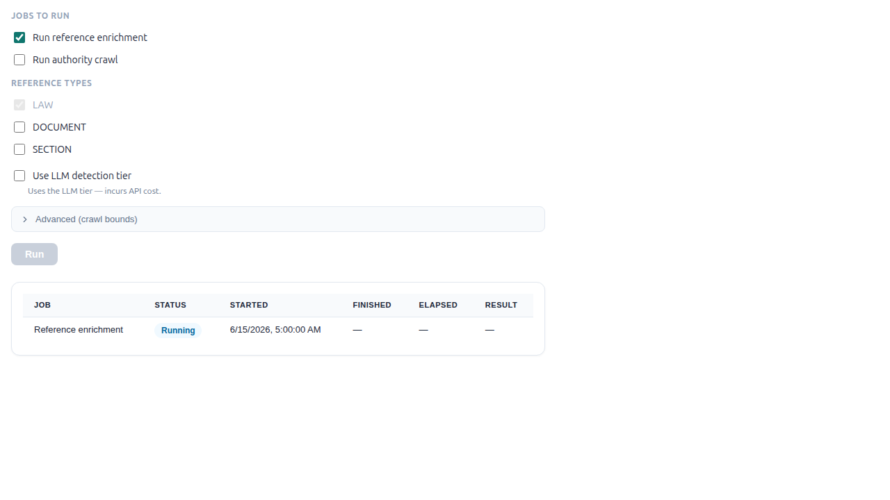
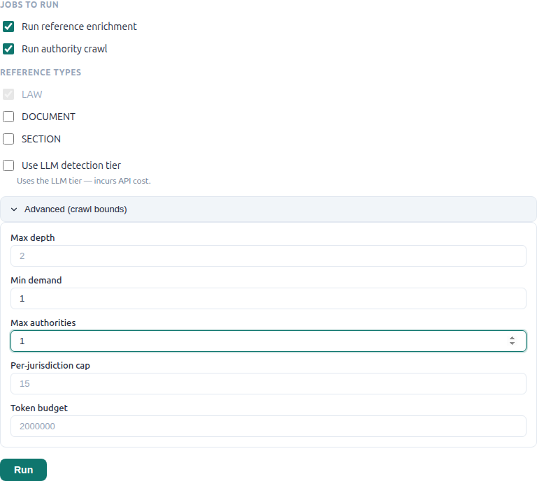
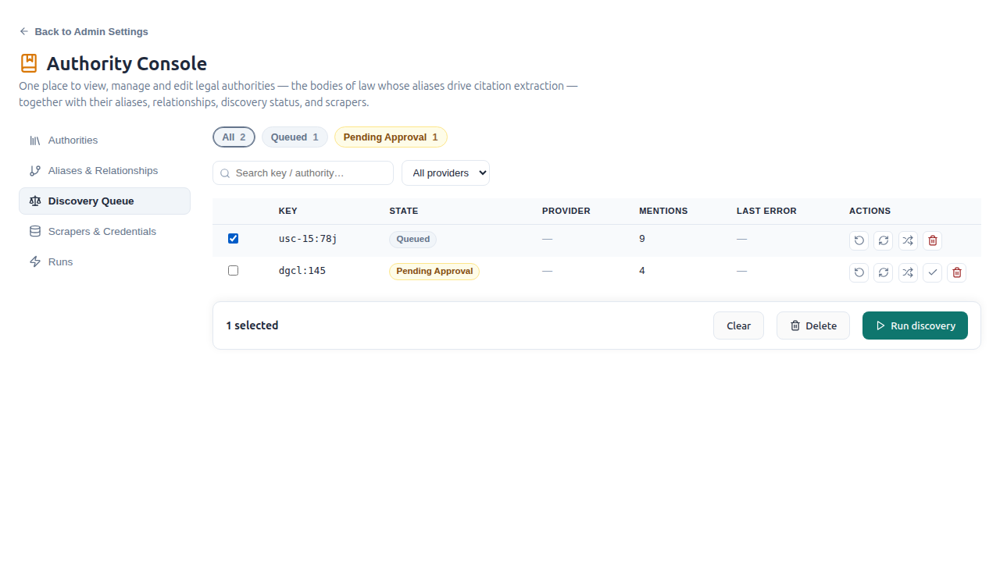

# Ingesting Authorities & Adding Providers

This is the operator how-to for the authority-discovery side of reference-web
enrichment: how to **ingest a source the system already supports**, and how to
**add a new provider** so a body of law that currently parks at `unsupported`
becomes ingestable.

For the architecture behind all of this — the detection tiers, the provisional
lifecycle, the crawl frontier, and the `discovery_state` machine — see
[Reference-Web Enrichment & Authority Discovery](../architecture/reference-web-enrichment.md).
This guide assumes that background and stays practical.

> **Vocabulary.** A *wanted authority* (or *wanted source*) is a law a corpus
> **cites but does not contain** — a `CorpusReference` row with
> `reference_type=LAW`, `resolution_status=EXTERNAL`, and a non-null
> `canonical_key` (e.g. `usc-15:78j`, `cfr-17:240.10b-5`, `dgcl:145`).
> "Ingesting" it means fetching the statute/regulation text from a public-domain
> source, materialising it as an authority document, and re-pointing the citing
> references from `EXTERNAL` to `RESOLVED`.

---

## Part 1 — Ingest a supported source

### What "supported" means

A source is **supported** when some registered provider's `can_handle(key)`
returns `True`. Today three deterministic providers
(`opencontractserver/pipeline/authority_source_providers/`) cover positive law:

| Provider | Handles keys | Source | Weight |
|----------|--------------|--------|--------|
| `USCodeAuthoritySourceProvider` | `usc-{title}:…` (any title, via regex) | OLRC USLM XML release-point ZIPs (`uscode.house.gov`) | heavy (~10–30 MB title ZIP) |
| `CFRAuthoritySourceProvider` | `cfr-{title}:…` (any title, via regex) | eCFR Versioner full-text XML (`www.ecfr.gov`) | light |
| `FederalRegisterAuthoritySourceProvider` | `fedreg` | Federal Register API (`federalregister.gov`) | light |

Two extra cases are also "supported":

- **Popular-name keys that bridge.** Filings cite popular names
  (`exchange-act:10`, `securities-act:2`) that no provider handles directly. If
  an `AuthorityKeyEquivalence` row maps the key to a positive-law counterpart
  (`exchange-act:10 → usc-15:78j`), `AuthorityDiscoveryService._provider_for`
  fetches the statutory key and the post-ingest relink upgrades the original
  popular-name references.
- **The agentic web locator** (`AgenticWebLocatorProvider`) is a last-resort
  open-vocabulary fallback. It is **disabled by default** and **approval-gated**
  — see [Part 2](#no-code-alternatives).

Everything else parks at `unsupported`.

> For a demonstration prefer a **CFR** key (`cfr-17:240.10b-5`, SEC Rule 10b-5)
> — the eCFR fetch is far lighter than an OLRC title ZIP.

### Option A — surgical: ingest exactly one source

The clearest way to watch one supported source go end-to-end. It seeds a single
`AuthorityFrontier` row and calls the orchestrator directly with
`relink_async=False`, so the **fetch → gate → bootstrap → relink** all happen in
one shell and the citing references flip to `RESOLVED` immediately.

```bash
docker compose -f local.yml run --rm django python manage.py shell -c '
from opencontractserver.users.models import User
from opencontractserver.annotations.models import AuthorityFrontier
from opencontractserver.enrichment.services.authority_discovery_service import (
    AuthorityDiscoveryService,
)

su = User.objects.filter(is_superuser=True).first()

row, _ = AuthorityFrontier.objects.get_or_create(
    canonical_key="cfr-17:240.10b-5",
    defaults={
        "authority": "cfr-17",
        "jurisdiction": "us-federal",
        "authority_type": "regulation",
        "mention_count": 1,
    },
)

res = AuthorityDiscoveryService.discover_and_bootstrap(
    creator_id=su.id, frontier_row=row, make_public=True, relink_async=False,
)
print("RESULT:", res)
row.refresh_from_db()
print("FRONTIER STATE:", row.discovery_state, "doc:", row.ingested_document_id)
'
```

`discover_and_bootstrap` only uses `frontier_row.canonical_key`; the
`jurisdiction`/`authority_type` defaults are cosmetic here (they matter only for
the crawl's per-jurisdiction cap). A `status: "ingested"` result, a
`discovery_state == "ingested"`, and a non-null document id mean it landed.
Because `relink_async=False`, `result["relinked_count"]` reflects the references
upgraded `EXTERNAL → RESOLVED` in the same call.

> This hits **live `.gov` endpoints** and creates a published corpus + document
> in your database.

### Option B — production path: crawl a corpus's wanted authorities

The real pipeline. The crawl seeds **only from finalized references**, so you
must run an enrichment pass *to completion* first — a still-running or failed
pass leaves its detections `is_provisional=True`, visible in the UI but invisible
to the crawl.

```bash
docker compose -f local.yml run --rm django python manage.py shell -c '
from opencontractserver.users.models import User
from opencontractserver.corpuses.models import Corpus
from opencontractserver.enrichment.services import EnrichmentService
from opencontractserver.enrichment.services.crawl_authorities_service import (
    CrawlAuthoritiesService,
)

su = User.objects.filter(is_superuser=True).first()
corpus = Corpus.objects.get(title="<YOUR CORPUS TITLE>")

# 1) Enrich to completion -> references finalize (is_provisional=False).
EnrichmentService().apply(corpus_id=corpus.id, creator_id=su.id)

# 2) Crawl. min_demand=1 so a singly-cited source still qualifies;
#    cap to one ingest and depth 0 (directly-cited only) for a tight test.
summary = CrawlAuthoritiesService.crawl(
    creator_id=su.id, corpus_id=corpus.id,
    min_demand=1, max_authorities=1, max_depth=0,
)
print(summary)
'
```

`summary["outcomes"]` tells you what happened (`{"ingested": 1}`, etc.) and
`summary["frontier_residual"]` is the full state census. This path uses
`relink_async=True`, so the `EXTERNAL → RESOLVED` flip runs in a *queued* Celery
task — a worker must be running, and it won't be reflected the instant the crawl
reports `ingested`.

### Option C — the Runs tab (no shell)

`/admin/authority/runs` (the Authority Console Runs tab, and the per-corpus
enrichment card) drives the same path via
the `runCorpusEnrichment` mutation. It requires corpus **UPDATE** (superusers
are exempt from UPDATE but still need READ).



To ingest authorities, tick **Run authority crawl**, open **Advanced (crawl
bounds)**, and set the bounds. The defaults are `max_depth=2`, `min_demand=2`,
`max_authorities=50`, `per_jurisdiction_cap=15`, `token_budget=2,000,000`
(blank = server default). For a single-source ingest like the shell example,
set **Min demand = 1** and **Max authorities = 1**:



The same finalized-only rule applies: run reference enrichment first (or leave
**Run reference enrichment** ticked alongside the crawl) so the frontier has
finalized references to seed from.

### Verify it landed

- **Frontier row** — `discovery_state == "ingested"`, `ingested_document_id` set,
  `provider` stamped with the class name.
- **Authority document** — a `Document` exists whose
  `custom_meta.canonical_key` equals the requested key (stamped by
  `AuthorityCorpusBootstrapper._stamp_key`).
- **Citing references** — `CorpusReference.resolution_status` flipped
  `EXTERNAL → RESOLVED` (immediate in Option A; after the Celery relink task in
  Options B/C), and the resolved doc→doc edge now appears in the governance
  graph.

---

## Part 2 — Add a provider (flip `unsupported` → supported)

### Spotting what needs a provider

The read-only Queue tab of the Authority Console at `/admin/authority/queue`
(superuser-only) is the instance-wide ingestion backlog over the whole
`AuthorityFrontier`.



Click the **Unsupported** state chip to filter to the cited authorities no
provider can handle. These — bodies of law with demand but no `.gov` source the
system knows how to fetch — are exactly the candidates for a new provider (or a
no-code alternative below).

### The provider contract

A provider is a subclass of `BaseAuthoritySourceProvider`
(`opencontractserver/pipeline/base/base_authority_source_provider.py`) dropped
into `opencontractserver/pipeline/authority_source_providers/`. The registry
**auto-discovers every subclass in that package** — there is no manual
registration step.

Five class variables (with sensible defaults) and two abstract methods:

```python
supported_prefixes: tuple[str, ...] = ()  # default can_handle(): prefix in supported_prefixes
license: str = "public-domain"            # the gate REJECTS anything else (blocked_license)
priority: int = 100                       # lower = preferred; the agentic fallback is 9999
requires_approval: bool = False           # True -> gate parks at pending_approval (no auto-ingest)
enabled: bool = True                      # False -> excluded from provider selection

def _locate_impl(self, canonical_key, **kw) -> AuthorityRequest   # PURE (no I/O) — derive URL/params
def _fetch_impl(self, request, **kw) -> list[AuthoritySection]    # the HTTP + parse lives here
```

`locate` / `fetch` / `can_handle` are public wrappers on the base; override
`can_handle` only when a fixed prefix tuple isn't enough (USC and CFR override it
with a regex so *all* titles work without code changes). The output is
`AuthoritySection(key, heading, text, source_url)` — `key` becomes the
document's `canonical_key` and **must match the requested key** (or surface the
section identifier in the heading), or the gate returns `unlocated`.

### Minimal skeleton

```python
"""Texas Business Organizations Code authority source provider (example)."""
from __future__ import annotations

from typing import ClassVar

from opencontractserver.enrichment.authorities import AuthoritySection
from opencontractserver.pipeline.base.base_authority_source_provider import (
    AuthorityRequest,
    BaseAuthoritySourceProvider,
)
from opencontractserver.utils.safe_http import safe_fetch_bytes


class TexasStatutesProvider(BaseAuthoritySourceProvider):
    title = "Texas Statutes"
    description = "Fetches Texas statute sections from <a public-domain .gov source>."
    license: ClassVar[str] = "public-domain"          # MUST be this, or the gate blocks it
    supported_prefixes: ClassVar[tuple[str, ...]] = ("tx-bus-org", "tx-tax")

    def _locate_impl(self, canonical_key: str, **kw) -> AuthorityRequest:
        prefix, section = canonical_key.split(":", 1)        # "tx-bus-org:21.001"
        return AuthorityRequest(
            canonical_key=canonical_key,
            url=f"https://<allowlisted-host>/.../{section}",
            params={...},
            citation=f"Tex. Bus. Org. § {section}",
            extra={"section": section, "source_url": "https://<human-readable-url>"},
        )

    def _fetch_impl(self, request: AuthorityRequest, **kw) -> list[AuthoritySection]:
        body, _ = safe_fetch_bytes(request.url, params=request.params)
        heading, text = _parse(body)                          # your parser
        return [
            AuthoritySection(
                key=request.canonical_key,                    # MUST equal the requested key
                heading=heading,
                text=text,
                source_url=request.extra["source_url"],
            )
        ]
```

Study `cfr_provider.py` (a clean single-request XML provider) and
`us_code_provider.py` (ZIP + namespaced XML, with a `_load_title_xml` seam that
tests patch to avoid network) as references.

### Three things that make it actually ingest

Writing the class is not enough — three gates stand between a registered provider
and an ingested document:

1. **Restart the process.** The registry is built once and cached permanently
   (`functools.lru_cache`). Dropping the file in the package is not enough —
   restart Django **and** the Celery worker
   (`docker compose -f local.yml up -d django celeryworker`). `enabled=True`
   (the default) means it goes live on restart.
2. **The source host must be on the public-domain allowlist.** The gate rejects
   any `source_url` whose host is not in `PUBLIC_DOMAIN_SOURCE_HOSTS`
   (`opencontractserver/constants/safe_http.py`) with `blocked_license`. Today
   that set is `ecfr.gov`, `federalregister.gov`, `govinfo.gov`, `gpo.gov`,
   `uscode.house.gov` (plus `www.` variants). A new host (e.g. a state `.gov`)
   must be **added there** — "every addition is a trust decision." Also note
   `safe_fetch_bytes` enforces HTTPS-only.
3. **`license` must be `"public-domain"`** — the first gate check. Anything else
   is blocked outright.

Verify discovery + routing *before* crawling:

```bash
docker compose -f local.yml run --rm django python manage.py shell -c '
from opencontractserver.enrichment.services.authority_discovery_service import (
    AuthorityDiscoveryService as A,
)
print(A._provider_for("tx-bus-org:21.001"))
# -> ("TexasStatutesProvider", <obj>, "tx-bus-org:21.001")
'
```

### No-code alternatives

Two ways to flip `unsupported → supported` without writing a provider:

- **Add an `AuthorityKeyEquivalence` row.** If the wanted key is a
  popular-name/domain key whose text is *already* a statute an existing provider
  handles, just add a DB row bridging it (e.g. `my-act:5 → usc-12:1841`).
  `_provider_for` then fetches the statutory key and the post-ingest relink
  upgrades the original references. Zero code.
- **Enable the agentic web locator.** `AgenticWebLocatorProvider` is
  `enabled=False` and `priority=9999` (absolute last resort). It can attempt any
  key, but because it is `requires_approval=True`, its results park at
  `pending_approval` for a human to confirm rather than auto-ingesting — the
  open-vocabulary safety valve. Set `enabled=True` to turn it on.

### Verify it ingests

Once the provider is registered and its host is allowlisted, re-run the crawl (or
Part 1 Option A with one of the now-supported keys). The previously
`unsupported` frontier rows should advance through `in_progress → ingested`, and
the `Unsupported` chip count on `/admin/authority/queue` should drop.

---

## Part 3 — Continuous push from an external harvester

For sources that change on their own schedule (proposed legislation, eCFR
amendments, caselaw feeds), an external harvester can push authority sections
into a corpus continuously instead of waiting for a pack re-install:

```
POST /api/worker-uploads/authority-sections/
Authorization: WorkerKey <token>
{"sections": [...], "equivalences": [{"from_key": "...", "to_key": "..."}]}
```

- **Token**: mint with `python manage.py mint_worker_token` — the token binds
  the batch to exactly one corpus (the payload never names a corpus).
- **Payload**: `sections` follows the single section-spec contract
  (`opencontractserver/enrichment/authorities.py::parse_section_spec` — same
  schema as `bootstrap_authority --spec` and pack specs), validated
  synchronously so a malformed batch is a 400 at push time. `equivalences`
  rows are upserted under source `worker:<account>` (curator- and pack-owned
  rows are never overwritten — see `authority_equivalence_ingest.py`).
- **Processing**: 202 + batch id; a drain task
  (`worker_uploads/tasks.py::process_pending_section_batches`) feeds
  `bootstrap_authority_corpus` (idempotent: unchanged text skips, changed
  text version-ups, metadata-only changes restamp) with an async relink of
  citing corpora. Poll `GET /api/worker-uploads/authority-sections/<id>/`
  for the bootstrap/equivalence report.
- **Caps**: `MAX_AUTHORITY_SECTION_PAYLOAD_BYTES` (default 32 MB) and the
  token's `rate_limit_per_minute` apply per batch.

## Permissions & safety recap

- `runCorpusEnrichment` (and therefore the crawl) requires corpus **UPDATE**;
  superusers may trigger it on any corpus they can **READ** without holding
  UPDATE.
- The crawl seeds from **finalized references only** — irreversible ingestion
  never acts on a still-running enrichment pass.
- The gate enforces **`public-domain` license + an allowlisted `.gov` source
  host + key verification** before any text is ingested; agentic results require
  human approval.
- `/admin/authority/queue` (the Authority Console Queue tab) is **superuser-gated**
  — it observes the frontier and offers per-row requeue/reset/reroute/approve/delete
  verbs; triggering enrichment runs stays on the Runs tab (`/admin/authority/runs`).
