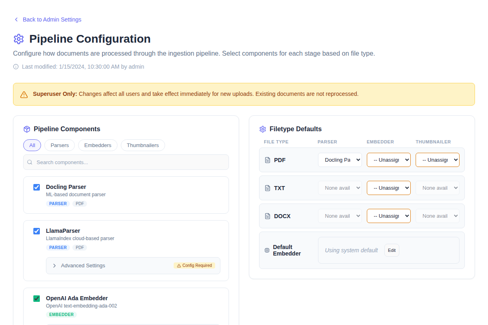
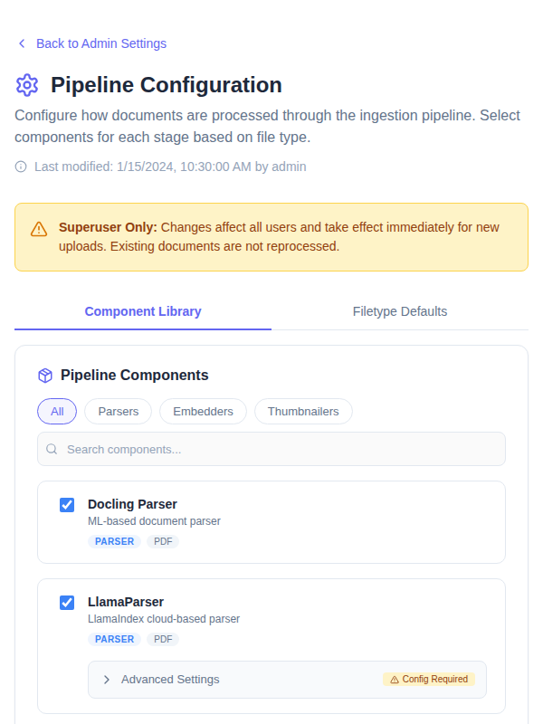
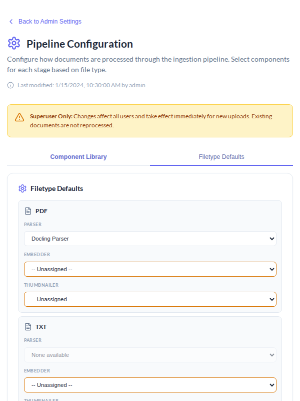
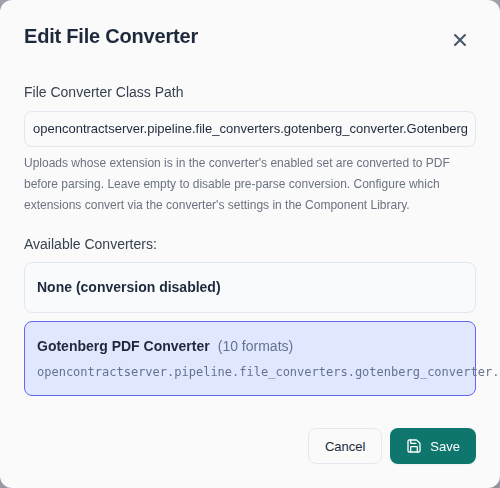
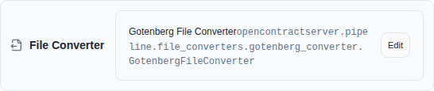

# Pipeline Configuration Guide

This guide covers how to configure the document processing pipeline in OpenContracts, including first-time setup, upgrades, and runtime configuration.

## Overview

OpenContracts uses a **database-backed configuration system** for pipeline settings. This allows superusers to change parsers, embedders, and thumbnailers at runtime without code deployment.

The configuration is stored in a singleton `PipelineSettings` model that tracks:
- **Preferred parsers** per MIME type
- **Preferred embedders** per MIME type
- **Preferred thumbnailers** per MIME type
- **Parser kwargs** (component-specific configuration)
- **Component settings** (advanced overrides)
- **Default embedder** (fallback when no MIME-specific embedder exists)
- **Encrypted secrets** (API keys, credentials)

## Discovering Available Components

Before configuring, discover what pipeline components are available and what settings they need:

```bash
# List all components and their settings
docker compose -f local.yml run django python manage.py migrate_pipeline_settings --list-components

# Filter to a specific component
docker compose -f local.yml run django python manage.py migrate_pipeline_settings --list-components --component LlamaParse
```

Example output:
```
======================================================================
AVAILABLE PIPELINE COMPONENTS
======================================================================

Parsers
----------------------------------------

  DoclingParser
    Class: opencontractserver.pipeline.parsers.docling_parser_rest.DoclingParser
    Title: Docling Parser
    Description: Parse documents using Docling ML service
    Supported types: application/pdf
    Settings (2):
      - force_ocr: bool
          default: False
          Force OCR on all pages
      - roll_up_groups: bool
          default: True
          Combine grouped elements

  LlamaParseParser
    Class: opencontractserver.pipeline.parsers.llamaparse_parser.LlamaParseParser
    Settings (1):
      - api_key: str [REQUIRED, SECRET]
          env: LLAMAPARSE_API_KEY
          LlamaParse API key

...
======================================================================
USAGE
======================================================================
  1. Set environment variables for required settings
  2. Run: python manage.py migrate_pipeline_settings
  3. Verify: python manage.py migrate_pipeline_settings --verify
======================================================================
```

## First-Time Setup (Fresh Install)

On a fresh installation, pipeline settings are automatically initialized from Django settings during migration.

```bash
# 1. Discover what components exist and what they need
docker compose -f local.yml run django python manage.py migrate_pipeline_settings --list-components

# 2. Set any required environment variables (see output from step 1)
# export LLAMAPARSE_API_KEY=your-key  # if using LlamaParse

# 3. Run migrations - creates PipelineSettings singleton from Django settings
docker compose -f local.yml run django python manage.py migrate

# 4. Migrate component settings from environment variables to database
docker compose -f local.yml run django python manage.py migrate_pipeline_settings

# 5. Verify all components have required settings
docker compose -f local.yml run django python manage.py migrate_pipeline_settings --verify
```

**That's it for basic setup.** The system will use sensible defaults:
- **Docling parser** for PDFs
- **TxtParser** for text files
- **MicroserviceEmbedder** for embeddings

### Environment Variables for First Boot

Set these in your `.env` file or docker-compose environment before first migration:

```bash
# Parser selection (optional - defaults to docling)
PDF_PARSER=docling  # Options: docling, llamaparse

# LlamaParse (if using llamaparse parser)
LLAMAPARSE_API_KEY=your-api-key-here

# Multimodal embedder (if using)
MULTIMODAL_EMBEDDER_HOST=multimodal-embedder
MULTIMODAL_EMBEDDER_PORT=8000
MULTIMODAL_EMBEDDER_VECTOR_SIZE=768
```

## Upgrading Existing Installation

When upgrading OpenContracts, the migration system preserves your existing configuration (if you've already setup pipeline settings in the DB). However, if Django settings have new defaults you want to adopt, use `--sync-preferences`:

```bash
# 1. Run migrations
docker compose -f local.yml run django python manage.py migrate

# 2. (Optional) Preview what would change if syncing from Django settings
docker compose -f local.yml run django python manage.py migrate_pipeline_settings --sync-preferences --dry-run

# 3. (Optional) Apply new defaults from Django settings
docker compose -f local.yml run django python manage.py migrate_pipeline_settings --sync-preferences

# 4. (Optional) Migrate any new component settings from environment
docker compose -f local.yml run django python manage.py migrate_pipeline_settings
```

### Understanding the Sync Behavior

| Scenario | What Happens |
|----------|--------------|
| Fresh install | Migration creates singleton from Django settings |
| Upgrade (no action) | Existing DB settings preserved |
| `--sync-preferences` | Overwrites DB preferences with current Django settings |
| `migrate_pipeline_settings` | Migrates component-specific settings from env vars |

## Runtime Configuration (Admin UI)

Superusers can configure the pipeline at runtime through the Admin UI:

1. Navigate to **Admin → Pipeline Configuration**
2. Configure preferred components per MIME type
3. Add API keys via the **Component Secrets** section
4. Configure the per-MIME-type enrichment chain (ordered list of enrichers —
   see [Enrichers](pipeline_overview.md#enrichers)) via the **Enrichment
   Chains** editor
5. Configure agent tool credentials (e.g. the web search tool) via the
   **Agent Tools** panel — see
   `frontend/src/components/admin/system_settings/ToolSecretsPanel.tsx`

### UI Overview

On desktop, the Pipeline Configuration page uses a **two-column layout** with the Component Library on the left and Filetype Defaults on the right:



On mobile and tablet viewports, the two sections collapse into a **tabbed interface**:



Switching to the Filetype Defaults tab shows the per-MIME-type parser/embedder/thumbnailer assignment:



### Component Secrets

Sensitive configuration (API keys, credentials) is stored encrypted in the database. Secrets are encrypted using Django's `SECRET_KEY`.

> **Warning**: If you rotate `SECRET_KEY`, all encrypted secrets become unrecoverable. Before rotating:
> 1. Export secrets via Django shell: `PipelineSettings.get_instance().get_secrets()`
> 2. After rotation, re-import: `instance.set_secrets(exported_secrets); instance.save()`

## File Converters (Gotenberg)

File converters are an **optional pre-parse step** that turns an upload with
no native parser (`.doc`, `.rtf`, `.odt`, `.pptx`, `.xlsx`, `.png`, and ~120
other extensions — see [Supported File Formats](../upload_methods/supported_formats.md#convertible-formats-via-gotenberg))
into a PDF before the normal parser/thumbnailer/embedder stages run. This is
a single install-wide setting (`PipelineSettings.default_file_converter`),
**not** file-type-scoped like the Parser/Thumbnailer columns above — there is
one converter selection for the whole install.

**Disabled by default.** A fresh install accepts only the three core formats
(PDF, TXT, DOCX) until you configure a converter. OpenContracts ships one
implementation out of the box, `GotenbergFileConverter`, which delegates to a
[Gotenberg](https://github.com/gotenberg/gotenberg) service's LibreOffice
route. See [File Converters](pipeline_overview.md#file-converters) in the
Pipeline Architecture doc for the full extension-eligibility and security
model (stored-MIME-type hardening, conversion-service egress/SSRF posture).

### The `gotenberg` service already runs in your stack

`local.yml` and `production.yml` both define a `gotenberg` service
(`gotenberg/gotenberg:8`) with no compose profile gate, so it starts
automatically with the rest of the stack (`docker compose -f local.yml up`,
etc.) alongside `django` and `celeryworker` — you don't need to add or start
anything at the compose level. It has no published host port (it's reachable
only on the docker bridge at `http://gotenberg:3000`, avoiding a collision
with the frontend dev server's own port 3000) and `django`/`celeryworker`
declare it as an optional dependency (`required: false`), so the stack still
starts normally if the container is ever removed. Until a converter is
selected in `PipelineSettings`, the container simply sits idle — no requests
are ever sent to it.

**Enabling conversion is therefore purely a `PipelineSettings` change**, made
either through the admin UI at runtime or via an environment variable at
first boot.

### Enabling via the Admin UI (runtime, no restart)

1. Log in as a superuser and navigate to **Admin → Pipeline Configuration**.
   The **File Converter** row lives in the Filetype Defaults panel, below
   **Default Embedder**. A fresh install shows it disabled:

   

2. Click **Edit** on the File Converter row to open the picker. Choose the
   **Gotenberg PDF Converter** card (or type a custom converter class path
   directly into the input, if you've registered your own `BaseFileConverter`
   subclass):

   

3. Click **Save**. The row now shows the configured converter's class path,
   and every subsequent upload whose extension is in Gotenberg's supported
   set is converted to PDF before parsing:

   

Changes take effect immediately for new uploads; documents already ingested
are not reprocessed.

### Disabling via the Admin UI

Repeat the same flow and pick **None (conversion disabled)** in the picker,
then **Save**. This writes an empty string to `default_file_converter`,
which the backend treats as "conversion off" — uploads outside the three
core formats are rejected again, exactly like a fresh install.

### Enabling/disabling via environment variable

For first-boot / infrastructure-as-code setups, set `DEFAULT_FILE_CONVERTER`
in your `.django` env file before running migrations — it seeds
`PipelineSettings.default_file_converter` the same way `PDF_PARSER` seeds the
preferred parser (see [First-Time Setup](#first-time-setup-fresh-install)
above):

```bash
# .envs/.local/.django or .envs/.production/.django

# Enable Gotenberg-powered conversion for non-core formats:
DEFAULT_FILE_CONVERTER=opencontractserver.pipeline.file_converters.gotenberg_converter.GotenbergFileConverter

# Leave unset (or empty) to keep conversion disabled — the default.
# DEFAULT_FILE_CONVERTER=
```

This only takes effect on first migration of a fresh `PipelineSettings`
singleton, or after `migrate_pipeline_settings --sync-preferences`, per the
[Configuration Priority](#configuration-priority) rules above — an existing
install should use the Admin UI instead, since the database is the runtime
source of truth.

Two related settings tune the Gotenberg connection itself (also configurable
as `GotenbergFileConverter` component settings in the Admin UI's Component
Library):

| Env var | Default | Purpose |
|---|---|---|
| `GOTENBERG_SERVICE_URL` | `http://gotenberg:3000` | Base URL of the Gotenberg service |
| `GOTENBERG_CONVERTER_TIMEOUT` | `300` | Conversion request timeout, in seconds |

To narrow the converter to a subset of extensions (e.g. only spreadsheets),
set its `convert_extensions` component setting to a comma-separated list —
see the **Component Library** panel or `GotenbergFileConverter.Settings` in
[`gotenberg_converter.py`](../../opencontractserver/pipeline/file_converters/gotenberg_converter.py).

## Management Command Reference

### `migrate_pipeline_settings`

```bash
# List all available components and their settings schemas
python manage.py migrate_pipeline_settings --list-components

# Filter to specific component
python manage.py migrate_pipeline_settings --list-components --component DoclingParser

# Preview what would be migrated
python manage.py migrate_pipeline_settings --dry-run

# Migrate component settings from environment variables
python manage.py migrate_pipeline_settings

# Force overwrite existing DB values with environment values
python manage.py migrate_pipeline_settings --force

# Verify all components have required settings
python manage.py migrate_pipeline_settings --verify

# Sync main preferences (PREFERRED_PARSERS, etc.) from Django settings
python manage.py migrate_pipeline_settings --sync-preferences

# Migrate settings for a specific component only
python manage.py migrate_pipeline_settings --component LlamaParseParser

# Verbose output showing all settings
python manage.py migrate_pipeline_settings --verbose

# Fail with exit code 1 if required settings are missing
python manage.py migrate_pipeline_settings --strict
```

## Configuration Priority

The system uses **database-only configuration** at runtime:

1. **Database settings** (`PipelineSettings` model) - the single source of truth
2. **Component defaults** - built-in defaults when no DB settings exist

> **Note**: Django settings (`PREFERRED_PARSERS`, etc.) are only read during initial migration to populate the database. At runtime, all configuration comes from the database. Use `--sync-preferences` to re-sync from Django settings after upgrades.

## Production Deployment

For production deployments:

```bash
# 1. Always run migrations first
docker compose -f production.yml --profile migrate up migrate

# 2. (First deploy only) Migrate settings from environment
docker compose -f production.yml run django python manage.py migrate_pipeline_settings

# 3. Start services
docker compose -f production.yml up -d
```

### Recommended Production Settings

```bash
# .env.production

# Use Docling parser (default, no API key needed)
PDF_PARSER=docling

# Or use LlamaParse (requires API key)
# PDF_PARSER=llamaparse
# LLAMAPARSE_API_KEY=your-production-key

# Embedder settings
DEFAULT_EMBEDDER=opencontractserver.pipeline.embedders.sent_transformer_microservice.MicroserviceEmbedder
```

## Troubleshooting

### Components Not Available

If a component doesn't appear in the UI:

```bash
# Check registered components
python manage.py migrate_pipeline_settings --verify --verbose
```

### Missing Required Settings

```bash
# Identify missing settings
python manage.py migrate_pipeline_settings --verify

# The output will show which settings need to be configured
```

### Reset to Defaults

To reset pipeline component assignments and settings to Django defaults:

1. Via Admin UI: Click "Reset to Defaults" button
2. Via management command:
   ```bash
   python manage.py migrate_pipeline_settings --sync-preferences --force
   ```

Reset restores `preferred_parsers`/`preferred_embedders`/`preferred_thumbnailers`/
`preferred_enrichers`/`parser_kwargs`/`component_settings`/the `default_*`
fields/`enabled_components` from their Django settings counterparts (see
`ResetPipelineSettingsMutation` in `config/graphql/pipeline_settings_mutations.py`).
**Stored secrets are never touched by Reset** — component secrets and agent
tool secrets (e.g. the web search tool's API key, see
`UpdateToolSecretsMutation`/`DeleteToolSecretsMutation`) must be cleared
separately via their own delete mutations if desired.

## See Also

- [Pipeline Architecture Overview](pipeline_overview.md)
- [Supported File Formats](../upload_methods/supported_formats.md)
- [Docling Parser](docling_parser.md)
- [LlamaParse Parser](llamaparse_parser.md)
- [Multimodal Embedder](multimodal_embedder.md)
