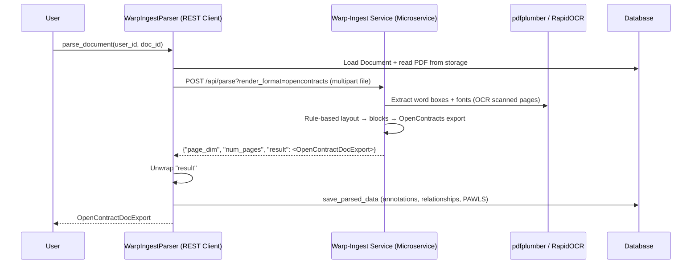

# Warp-Ingest Parser (REST API)

## Intro

The Warp-Ingest Parser is an **alternative PDF parser** for OpenContracts based on
[Warp-Ingest](https://github.com/Open-Source-Legal/Warp-Ingest) — a
*deterministic, rule-based* PDF parser. Instead of a machine-learning layout
model, it derives structure from text coordinates, graphics, and font metadata
(via `pdfplumber`), with optional [RapidOCR](https://github.com/RapidAI/RapidOCR)
for scanned pages. There is no GPU requirement and no per-page image
rasterization, so parses are fast and reproducible.

Like the [Docling Parser](docling_parser.md), it runs as a **microservice** and
is accessed over REST, keeping the heavy parsing dependencies out of the Django
image. Its defining feature for OpenContracts is that it renders **directly to
the OpenContracts structural export format** — PAWLS word tokens, per-block
structural annotations, and a heading hierarchy expressed as `parent_id` links
plus explicit relationships — so no lossy format translation is required.

Docling remains the default PDF parser; Warp-Ingest is opt-in and selected
per-corpus / file-type in the admin **System Settings** UI (or by seeding
`PipelineSettings`).

## Architecture



## Implementation

- Parser: `opencontractserver/pipeline/parsers/warp_ingest_parser.py::WarpIngestParser`
- Base class: `opencontractserver/pipeline/base/parser.py::BaseParser`
  (non-chunked — see [Chunking](#why-not-chunked) below)
- Auto-discovered by `opencontractserver/pipeline/registry.py`; no manual
  registration needed.

## Configuration

Settings live in the `PipelineSettings` DB singleton — the runtime source of
truth — and are edited via the admin **System Settings** UI. There are two ways
a value gets there:

**1. Seeded from `config/settings/base.py` by `migrate_pipeline_settings`.** The
command resolves each setting's `env_var` as a Django settings attribute
(`getattr(settings, env_var)`), so **only** these three — which have matching
attributes in `base.py` — are populated from the environment at migrate time:

| Env var (in `base.py`) | Setting field | Default | Purpose |
|---------|---------------|---------|---------|
| `WARP_INGEST_PARSER_SERVICE_URL` | `service_url` | `http://warp-ingest:5001/api/parse` | Warp-Ingest `/api/parse` endpoint |
| `WARP_INGEST_API_KEY` | `api_key` | `""` | Sent as `X-API-Key`; must match the service's `WARP_API_KEY` |
| `WARP_INGEST_PARSER_TIMEOUT` | `request_timeout` | `600` | HTTP request timeout (seconds) |

**2. Component-setting defaults, changed via the admin System Settings UI.** The
remaining fields exist only as `PipelineSetting` metadata on the parser's
`Settings` dataclass. Their `env_var` names are metadata; because they have no
`base.py` attribute, setting them in `.env` does **not** change them via
`migrate_pipeline_settings` — edit them in the admin UI (this matches the other
parsers, e.g. Docling's image/OCR fields):

| Setting field | `env_var` metadata | Default | Purpose |
|---------------|--------------------|---------|---------|
| `use_cloud_run_iam_auth` | `WARP_INGEST_USE_CLOUD_RUN_IAM_AUTH` | `False` | Force Google Cloud Run IAM `Authorization` bearer |
| `apply_ocr` | `WARP_INGEST_APPLY_OCR` | `False` | Force OCR on every page |
| `disable_ocr` | `WARP_INGEST_DISABLE_OCR` | `False` | Disable OCR (mutually exclusive with `apply_ocr`) |
| `semantic_units` | `WARP_INGEST_SEMANTIC_UNITS` | `False` | Append the Semantic-Unit clause annotation layer |
| `include_images` | `WARP_INGEST_INCLUDE_IMAGES` | `False` | Embed extracted images in the export |
| `max_file_size_mb` | `WARP_INGEST_MAX_FILE_SIZE_MB` | `200` | Reject PDFs larger than this (checked against storage size before reading) |

The single request-timeout constant lives at
`opencontractserver/constants/document_processing.py::WARP_INGEST_PARSER_REQUEST_TIMEOUT_SECONDS`
and backs both the Django setting default and the dataclass field default.

### Authentication

Warp-Ingest always requires an API key (its own default is `abc123`; the server
logs a loud warning when serving on that fallback). OpenContracts sends the key
in the **`X-API-Key`** header — deliberately *not* `Authorization: Bearer`,
which Warp-Ingest also accepts — so the `Authorization` header stays free for a
Google Cloud Run IAM id_token when the service runs behind Cloud Run IAM
(`use_cloud_run_iam_auth`). Set `WARP_INGEST_API_KEY` on the OpenContracts side
to the same value as the service's `WARP_API_KEY`.

## Microservice Setup

Run the official image, `ghcr.io/open-source-legal/warp-ingest`. Both `local.yml`
and `production.yml` define a `warp-ingest` service behind the opt-in
**`warp-ingest` compose profile** (it is not started by default because the image
is ~2.5 GB):

```bash
# Start the stack with Warp-Ingest available
docker compose -f local.yml --profile warp-ingest up
```

```yaml
# local.yml / production.yml (abridged)
services:
  warp-ingest:
    image: ghcr.io/open-source-legal/warp-ingest:latest
    container_name: warp-ingest
    profiles:
      - warp-ingest
    environment:
      - WARP_API_KEY=${WARP_INGEST_API_KEY:-abc123}
```

Health endpoints: `GET /` and `GET /healthz` (the latter reports version and
`ocr_available`). The container listens on port `5001` (override with
`WARP_PORT`).

## Input / Output

**Input:** a PDF stored in Django's storage, plus a user ID and document ID.

**Request:** `POST /api/parse?render_format=opencontracts` with the PDF as a
multipart `file` field and the OCR / semantic-unit / image flags as query
params.

**Response:** `{"page_dim": ..., "num_pages": ..., "result": <export>}`. The
parser unwraps `result` (falling back to the top-level body if a future API
revision returns the export unwrapped) and returns an `OpenContractDocExport`:

```python
{
    "title": str,
    "content": str,                 # full text
    "description": str | None,
    "pawls_file_content": list,     # PAWLS token pages
    "page_count": int,
    "doc_labels": list,
    "labelled_text": list,          # structural annotations (annotationLabel, rawText, parent_id, ...)
    "relationships": list,          # heading hierarchy + group relationships
    "file_type": str,
}
```

The export already uses OpenContracts field names (snake_case top-level keys,
camelCase `annotationLabel` / `rawText` within annotations), so **no key
normalization** is performed — it flows straight into `save_parsed_data`.

## Why not chunked?

Unlike the Docling parser (which splits large PDFs into overlapping page-range
chunks via `BaseChunkedParser`), Warp-Ingest sends the **whole PDF in one
request**:

- It is CPU-only (no per-page GPU layout model), so bounded per-request cost —
  the main motivation for Docling chunking — does not apply.
- Its native `/api/parse` API accepts a whole file.
- It performs cross-page structure joining (heading hierarchies, tables and
  lists spanning page boundaries) that page-range chunking would fragment.

For very large scanned documents, raise `WARP_INGEST_PARSER_TIMEOUT` rather than
introducing chunking.

**Memory footprint:** because the whole PDF is buffered in the worker and POSTed
in one request, peak memory per concurrent parse scales with the file size.
`WARP_INGEST_MAX_FILE_SIZE_MB` (default 200) caps this — the parser checks the
file's storage size *before* reading it, so a PDF above the limit is rejected
with a permanent `DocumentParsingError` and is never buffered at all. Raise it if
you routinely ingest larger scans, sizing it against
`worker memory / expected concurrent parses`.

## Error Handling

The REST client raises `DocumentParsingError` with an `is_transient` flag the
ingestion pipeline uses to decide whether to retry:

- **Timeout / connection errors** → transient (retryable).
- **4xx** (e.g. `415` unsupported media type, `401` bad key, `422` both
  `apply_ocr` and `disable_ocr` set) → permanent (no retry).
- **5xx** → transient.
- A `apply_ocr` + `disable_ocr` conflict is caught client-side and fails fast
  (permanent) before any HTTP call.

## Testing

- Unit tests (mocked HTTP): `opencontractserver/tests/test_doc_parser_warp_ingest.py`
- End-to-end smoke test against the real container:
  `docs/test_scripts/warp_ingest_parser_smoke_test.md`

## See Also

- [Pipeline Overview](pipeline_overview.md)
- [Docling Parser](docling_parser.md) — the default PDF parser
- [LlamaParse Parser](llamaparse_parser.md) — cloud-based alternative
- [PDF Data Layer Architecture](../architecture/PDF-data-layer.md)
- [Warp-Ingest](https://github.com/Open-Source-Legal/Warp-Ingest)
